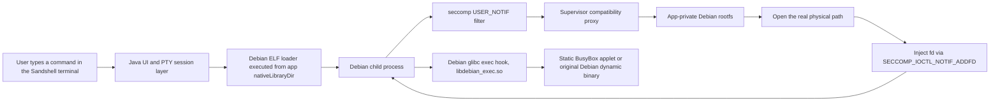

# Sandshell

     

**English** | [简体中文](README.zh-CN.md)

> **2026-09-13 — Renamed to Sandshell.** The Debian trademark team declined this project's previous name ("Debian Mobile"), the Debian swirl launcher icon, and the `com.debian.*` package namespace (2026-08-28); the v0.1 release and the dev-archive were withdrawn the same day. The project is now renamed **Sandshell** (`dev.sandshell.core`), and a re-identified v0.1 build has passed device regression and been re-released. What remains true and permitted: this app runs an unmodified Debian Bullseye ARM64 userland, and honest, non-misleading statements to that effect are fine. See [docs/trademark.md](docs/trademark.md).

Sandshell runs a real Debian Bullseye (ARM64) userland inside an ordinary, unprivileged Android application sandbox. No root, no PRoot, no ptrace as the runtime core, no virtual machine, and no kernel modification: just an Android app, a seccomp `USER_NOTIF` supervisor, and a carefully mediated Debian rootfs that lives in the app's private storage.

The interesting problem here is not "unzip a Debian directory onto a phone". Anyone can do that. The interesting problem is that a Debian process believes it lives at `/usr/bin`, while the kernel insists it lives at `/data/user/0/<package>/files/debian/usr/bin`, and neither side is willing to compromise. Sandshell resolves this standoff with a compatibility layer that is deliberately thin, auditable, and honest about its own limits: a supervisor process intercepts selected path-related syscalls, translates logical Debian paths into physical paths inside an app-private rootfs, and injects the resulting file descriptors back into the Debian child. Android's inherited security policy, including every `KILL` rule the OEM shipped, remains fully in force. We treat that as a feature, not an obstacle.

Everything claimed in this README is backed by exit codes from a physical device. If a feature is not listed as verified, assume it is not verified. That discipline cost us 90 "Parts" of debugging, and it is the most reusable thing this project produces.

## Table of Contents

- [What This Is](#what-this-is)
- [Verified Capabilities](#verified-capabilities)
- [How It Works](#how-it-works)
- [Security Model and Non-Goals](#security-model-and-non-goals)
- [Getting Started](#getting-started)
- [The Hard Problems](#the-hard-problems)
- [Known Limitations and Honest Boundaries](#known-limitations-and-honest-boundaries)
- [Verification Philosophy](#verification-philosophy)
- [Development History](#development-history)
- [Roadmap](#roadmap)
- [Contributing](#contributing)
- [License](#license)
- [Trademarks](#trademarks)
- [Upstream Lineage](#upstream-lineage)

## What This Is

Sandshell is an experimental, lightweight Debian ARM64 runtime for a constrained Android application domain. It starts a Debian ELF loader directly from the app's `nativeLibraryDir` (which Android permits apps to execute), then mediates selected absolute-path operations so that the Debian userland can function against a rootfs stored under the app's private files directory.

Compared with the usual approaches:

| Approach | How it fakes `/` | What Sandshell does instead |
|---|---|---|
| Root + `chroot` | Kernel-level namespace switch | Rejected: requires root |
| PRoot | `ptrace` syscall rewriting | Rejected: ptrace as runtime core is slow, fragile on OEM kernels, and against project principles |
| Termux-style native prefix | Not Debian; packages rebuilt against Android's bionic | We run the real Debian Bullseye rootfs and official `.deb` packages, unmodified |

The terminal UI descends from the official Termux v0.118.3 codebase, adapted for this runtime. The app is a terminal, not a compatibility gimmick: PTY sessions, job control, scrollback, and alternate-screen TUI behavior are first-class concerns.

### Scope statement

Sandshell is a terminal runtime with a bounded compatibility layer. It is not a general-purpose container, not a root tool, not a security bypass, and not a complete Termux replacement. The set of working commands is exactly the set that has passed device-side verification, listed below.

## Verified Capabilities

Target environment: Android 16 /17 (HyperOS 3 /4), AArch64, SELinux `untrusted_app_27`. All rows below have real-device exit code 0 on record.

| Capability | Evidence |
|---|---|
| Debian shell with path virtualization (`/bin`, `/usr`, `/lib`, `/etc` visible as logical Debian paths) | Verified since the first MVP, re-verified in every regression round |
| Basic commands: Debian Bash, curated static BusyBox applets, `hello`, `curl --version`, `nano --version` | Device-verified |
| Controlled Debian package management: `apt update`, `apt install -y gcc`, `hello`, `curl`, `nano`, `apt --fix-broken` | Device-verified, including the GCC toolchain path |
| PTY sessions with job control: foreground process reaping, prompt recovery, Ctrl+C | Device-verified via the sole high-number `ALLOW`, `wait4(260)` |
| Basic TUI alternate-screen behavior (BusyBox `vi` enter and `:q!` exit, main screen intact) | Device-verified |
| In-app self-check: 18-item Validation suite | Multiple 18/18 PASS records |
| User-supplied musl Node 22 minimal entry: `node --version` (v22.23.2), a running JS one-liner, `npm --version` (10.9.8) | Device-verified; experimental, user-imported, not bundled. See [case file 3](#case-3-the-node-wall-and-the-musl-detour) |

Explicitly not verified and not claimed: full GNU coreutils coverage, arbitrary network reachability, a complete xterm-compatible terminal, the Node/npm ecosystem beyond minimal commands, and opencode (that experiment was frozen before completion; see the [frozen line note](#case-7-the-frozen-line-opencode)).

## How It Works



### Entry point: direct loader execution

Android allows an app to execute an ELF that ships in its native library directory. Sandshell exploits this as the single sanctioned entry: the Debian AArch64 dynamic loader is packaged as an app library and executed directly. Nothing runs from `memfd`, and no arbitrary Android-side ELF is ever executed as Debian.

### Path virtualization via seccomp USER_NOTIF

The Debian child installs a seccomp filter with `SECCOMP_RET_USER_NOTIF` on 18 path- and identity-related syscalls. When the child performs one of these calls, the kernel parks it and hands the request to the supervisor process, which:

1. Resolves the logical Debian path (for example `/etc/passwd`) against the physical rootfs (`<app files>/debian/etc/passwd`).
2. Performs the real operation inside the app-private rootfs, honoring a controlled write whitelist. Anything outside the whitelist fails with `EROFS`, honestly.
3. For `openat`-class calls, opens the real file and installs the descriptor into the child with `SECCOMP_IOCTL_NOTIF_ADDFD`, then resumes the child.

The mediated syscall set (AArch64 numbers): `mkdirat(34)`, `unlinkat(35)`, `symlinkat(36)`, `renameat(38)`, `statfs(43)`, `faccessat(48)`, `fchmodat(53)`, `fchownat(54)`, `fchown(55)`, `openat(56)`, `readlinkat(78)`, `newfstatat(79)`, `fstat(80)`, `utimensat(88)`, and `getuid(174)`/`geteuid(175)`/`getgid(176)`/`getegid(177)` for the fakeroot identity presentation.

Relative paths pass straight through: the child's working directory already sits inside the rootfs, so `./configure` needs no translation at all.

### exec dispatch and the shim

`execve(221)` is deliberately not mediated. Translation at exec time happens instead in userspace, inside a `LD_PRELOAD` hook (`libdebian_exec.so`) built against Debian Bullseye's glibc:

- Dynamic ELF: dispatched through the physical Debian loader.
- ELF with no `PT_INTERP` (static-PIE, such as `ldconfig`): raw `execve`.
- Shebang scripts: interpreter mapping to the physical interpreter path.
- A small, audited list of applets: dispatched to a verified static BusyBox.

A second shim, `noshm3.so`, neutralizes three syscalls that cannot survive this environment (see [case file 1](#case-1-three-rats-and-one-shim)). It returns honest `ENOSYS` for System V IPC and io_uring setup, and services `getrandom` by performing full reads of the real `/dev/urandom`. No fake success, no weakened random, ever.

### fakeroot, the honest kind

Debian tooling expects `root`. The supervisor presents uid/gid 0 for identity queries and returns success for `fchown`-class calls without altering the real inode; `utimensat` first attempts the real operation and only then reports the permitted outcome. This is identity presentation for compatibility, not privilege escalation: real UIDs, SELinux labels, and the inherited seccomp policy are untouched.

### Terminal layer

Each session gets a real PTY (`posix_openpt`, `setsid`, `TIOCSCTTY`, `tcsetpgrp`) with a 24x80 canonical+ISIG termios setup. The Java side implements a bounded VT screen: CSI sequences, 16/256-color SGR, scrollback, alternate screen, touch scrolling, and raw-key passthrough including Esc. Foreground job reaping relies on `wait4(260)`, which is the one and only high-numbered `ALLOW` in the entire BPF program. That exception exists for a reason and is not negotiable in contributions.

## Security Model and Non-Goals

The security posture is asymmetric on purpose: Android's rules always win.

| Rule | Meaning |
|---|---|
| No root, no PRoot, no AVF, no kernel changes | The runtime lives entirely inside an ordinary app's privileges |
| Inherited seccomp is never modified | OEM `KILL` actions cannot be weakened by rules installed later; we do not try |
| No new high-numbered `ALLOW` | `wait4(260)` is the only one, required for job control |
| Honest `ENOSYS` | Unsupported syscalls fail as unsupported; we never fake success |
| Controlled write surface | Writes go to whitelisted paths in the app-private rootfs; everything else gets `EROFS` |
| No bundled Node, npm, opencode, or third-party business tools | Users may import their own binaries at their own risk; see the frozen line note |

When marketing this project, the accurate phrasing is: "seccomp `USER_NOTIF` path mediation with controlled fd injection inside an app-private rootfs". The inaccurate phrasings, which we ask everyone to avoid, include "Android sandbox bypass", "root", and "full chroot".

## Getting Started

**The v0.1 release is withdrawn (2026-08-28) and re-released as Sandshell (2026-09-19).** The Debian trademark team declined the "Debian Mobile" name, the Debian swirl icon, and the `com.debian.runtime` package name, so the old build can no longer be distributed; the maintainer preserves it offline. The renamed build ships as **Sandshell** (`dev.sandshell.core`), with a new signing key and the same verified runtime.

v0.1 is the device-validated Part58 build with release hygiene applied: debug flag removed, permissions cut from 15 to 8, the external command API disabled, and a fresh signing key. Because the signing key rotated, uninstall any older development build first — the app uses `sharedUserId`, and Android rejects cross-signature upgrades.

The interop folder (`/storage/emulated/0/sandshell-ext` on the Android side, `/mnt/sdcard` inside Debian) is kept; enable "All files access" for the app in system settings once, and the bridge works as in Part58.

### Requirements

- An Android 16+ device, AArch64, ideally the tested class (HyperOS 3 /4, `untrusted_app_27` domain). Behavior on other OEM seccomp policies is not guaranteed and is device-dependent.
- Several hundred MB of free app-private storage for the rootfs.
- No special permissions. That is the point.

### First run

1. Install the APK and launch the app. First launch unpacks and verifies the Debian Bullseye ARM64 rootfs into the app's private storage.
2. A Bash prompt appears in a PTY session. Basic path virtualization is already active: `ls /usr/bin`, `cat /etc/passwd`.
3. Open the Validation page and run the 18-item suite. All 18 must pass before anything else is worth trying.
4. The verified package-management path:

```console
$ apt update
$ apt install -y hello curl nano
$ hello
$ curl --version
$ apt install -y gcc
```

Every command above has a real-device exit code 0 on record. Commands outside this list may work; they simply have not been verified, and issues about them should say so plainly.

### About Node.js

Sandshell does not bundle Node.js and does not promise it. Official glibc Node builds die under inherited seccomp on the tested device class (see [case file 3](#case-3-the-node-wall-and-the-musl-detour)). A user-supplied musl Node 22, imported into `/usr/local/node-musl` and dispatched through the runtime's precise loader routing, has passed minimal commands (`node --version`, a JS one-liner, `npm --version`) on the target device. This is documented as an experimental capability of the dispatch mechanism, not as a supported Node platform: full npm lifecycles and global package installs remain unverified and are known to walk through several landmines described in the case files below.

## The Hard Problems

The rest of this README is the part we are actually proud of. Each case below follows the same format: what we saw, what we wrongly believed at first, what was actually true, and the lesson that survived. These are engineering case files, not feature claims; several of them ended in "frozen, unfinished", and we say so. The case files tell the full stories; a one-line quick-reference version of every pitfall lives in the [pitfall guide](docs/pitfalls.md).

### Case 1: Three Rats and One Shim

**Symptom.** Node 22 starts and dies instantly with `Bad system call`, exit 159 (`SIGSYS`). No output, no core, no explanation. Repeating the experiment with different Node versions changed nothing, which was the first hint that the problem was not in Node.

**Red herrings.** A corrupted download. A wrong architecture build. A glibc symbol mismatch. All wrong, and each one cost a round trip.

**Root cause.** Three unrelated syscalls, each fatal, each from a different authority:

| Syscall | Number | Who kills it | Why Node trips it |
|---|---|---|---|
| `shmget` | 194 | Android's inherited seccomp (`KILL`) | V8/ICU probing System V IPC at startup |
| `getrandom` | 278 | Our own BPF (`>=260` guarded, returns `ENOSYS`) | Crypto and UUID initialization |
| `io_uring_setup` | 425 | Android's inherited seccomp (`KILL`) | libuv probing io_uring |

The first and third come from the OEM policy layer, which a post-install BPF cannot override: once the kernel has a `KILL` action for a syscall, later filters can only make things stricter, never looser. The second one was self-inflicted by our own high-number guard.

**Fix.** One preload shim, `noshm3.so`, three kills: return `ENOSYS` for `shmget` (honest: System V IPC is simply not available), service `getrandom` by fully reading the real `/dev/urandom` (never a weak fallback, never a fake success), and return `ENOSYS` for `io_uring_setup` so libuv falls back to its epoll path. Node also runs with `UV_USE_IO_URING=0` as belt and suspenders.

**Lesson.** `SIGSYS` with no output almost always means a syscall died before userspace could complain. Enumerate the victim's syscall surface before blaming the binary. And an `LD_PRELOAD` shim can only intercept libc function calls; it cannot save a program that issues raw `svc` instructions (this returns as a limitation in [case 7](#case-7-the-frozen-line-opencode)).

### Case 2: The ABI Catastrophe

**Symptom.** After one routine rebuild, every ordinary Debian session exited immediately at startup. Not some commands: all of them, instantly.

**Root cause.** The `libdebian_exec.so` preload hook had been recompiled with the Android NDK, producing a bionic-ABI binary, and then preloaded into Debian glibc processes. Two ABI universes met in one address space; the loser was the session.

**Fix and permanent rule.** Hooks that run inside Debian processes must be built against Debian Bullseye's glibc toolchain, with `NEEDED` entries limited to `libc.so.6` and `ld-linux-aarch64.so.1`. The NDK builds Android-side code; it never builds code that loads into Debian. The offending artifact was retired permanently, and this rule is now a contribution gate.

**Lesson.** In a dual-runtime architecture (Android app plus Debian userland), "it compiles" is not evidence of anything. The ABI you link against is the ABI you must live in.

### Case 3: The Node Wall and the musl Detour

**Symptom.** Every official Node build, glibc-linked, died as in case 1. The verdict after systematic on-device probing: a whole class of syscalls used by V8 and libuv is `KILL`-listed by the inherited seccomp, and no userspace layer can lower that priority. The official Node/npm route was closed on this device class, full stop.

**The detour.** musl-linked Node avoids some of the glibc startup path, and with `noshm3.so` it stays alive. But it brings its own constraint: a musl process cannot preload a glibc hook, and it must not inherit glibc-flavored `LD_PRELOAD`/`LD_LIBRARY_PATH` variables from its parent, or the two worlds collide exactly as in case 2.

**Fix.** Precise dispatch: when exec matches the exact physical paths of the user-imported musl Node tree (`/usr/local/node-musl/...`), the runtime strips every inherited loader variable, then injects the musl loader, `noshm3.so`, and `UV_USE_IO_URING=0`. Bare `node --version` returns `v22.23.2`, a JS one-liner runs, `npm --version` returns `10.9.8`; all with exit code 0 on the target device. Ordinary Debian paths remain untouched by this routing.

**Lesson.** When two libc worlds must coexist, isolation must be explicit at every process boundary: inherited environment is state, and state is a bug vector. Also: a minimal command passing is a data point about the dispatch mechanism, not a promise about the ecosystem, which is why this row of the capability table is marked experimental.

### Case 4: The chdir Lie

**Symptom.** npm's lifecycle spawns failed with `spawn sh ENOENT`. The natural reading: the shell is missing. It was not; `/bin/sh` existed and ran fine when invoked directly.

**Root cause.** npm `chdir`s into the package directory before spawning. The directory it was given was a logical Debian path, which does not exist as a physical path the kernel can enter. The `chdir` failed, npm surfaced it as a misleading `ENOENT` about the spawn, and everyone stared at the wrong file.

**Fix.** Give npm physical paths everywhere they are load-bearing: `prefix`, `cache`, and `script-shell` in `npmrc` all point at the real location under the app-private rootfs. The spawn error vanished, because it had never been about spawning.

**Lesson.** In a path-translated environment, error messages describe the last failure, not the first. `cwd` and `PATH` are load-bearing infrastructure; when a process dies at startup, audit what it tried to enter before what it tried to exec.

### Case 5: The execvp Funnel

**Symptom.** During the `ETXTBSY` investigation (next case), errors kept pointing at a wrapper script that we could prove was fine, while the real binary was silently never executed at all.

**Root cause.** Classic `execvp` semantics, with a sandbox twist. `ENOENT` is a "keep searching" verdict for `execvp`: if the first `PATH` candidate fails with `ENOENT`, it tries the next one. Critically, a missing ELF interpreter (`PT_INTERP` pointing at a path that cannot be opened) also surfaces as `ENOENT`. But `ETXTBSY` is terminal; the search stops and the error is reported.

So the actual sequence was: the real binary's interpreter path failed to resolve (`ENOENT`, silently, search continues), the search reached a locked wrapper file, and the locked file produced `ETXTBSY`, which was reported. The error named the wrong suspect entirely.

**Lesson.** When `execvp` reports a weird error, the reported file is the last candidate, not the intended one. A missing `PT_INTERP` masquerades as "file not found", and the masquerade is silent.

### Case 6: ETXTBSY, or One Missing close()

**Symptom.** `npm install` reaches postinstall and dies with `sh: node: Text file busy`. `ETXTBSY` classically means "someone is executing this file right now". Nobody was.

**Red herrings.** A concurrent watcher. A leftover npm daemon. An antivirus-like scan. Each hypothesis was tested and died; one inode-replacement workaround (write a new file and `rename` over the old path) made the symptom move, which was the clue that the file itself was being held, not executed.

**Root cause.** Our own supervisor. The `USER_NOTIF` handler for `openat` opens the real file locally, then injects it into the child with `SECCOMP_IOCTL_NOTIF_ADDFD`. The kernel duplicates the descriptor into the child, but the supervisor's local copy was never closed. Every write-open by a Debian process therefore leaked one additional write handle, held by the supervisor for its entire lifetime. After enough `npm` runs, the supervisor was sitting on a fistful of write locks over the exact `node` wrapper the postinstall wanted to execute. `ETXTBSY` was, for once, telling the truth: the file was busy, just not by an executor.

**Fix.** One line: `close(local_fd)` after the `ADDFD` ioctl. The whole class of leaks disappeared.

**Lesson.** In fd-injection designs, the injector's bookkeeping is part of the contract; a descriptor handed to the kernel still belongs to you until you close it. And when a canonical error seems impossible, `/proc/<pid>/fd` of every long-lived process in your architecture beats any amount of theorizing. The defensive pattern (write to a temporary path, then `rename` for inode replacement) also earned a permanent place in the toolbox.

### Case 7: The Frozen Line (opencode)

This one did not end in victory, and that is exactly why it is documented.

**Symptom.** With Node and npm minimally alive, installing opencode (a Bun-built, dynamically-linked platform binary distributed through npm) hit a conveyor belt of failures, each of which was real and none of which was the last: a package cache that appeared empty (a scanning bug in our own forensics tooling, two distinct bugs in reading npm's `cacache` index format), a `tar` resolution polluted by a leftover shadow directory on `PATH`, an `npmrc` that a derived npm call ignored in favor of default cache locations, a musl/glibc platform-package mismatch, and a wrapper that guessed the wrong glibc loader filename.

Two findings from this line are worth keeping regardless of its fate. First, npm's libc detection reads the `ldd` on `PATH`; on Debian it finds "GNU C Library" and correctly selects the glibc platform package, so the "wrong package" hypothesis was itself wrong. Second, on AArch64 the glibc loader chain ends at `ld-2.31.so` via `ld-linux-aarch64.so.1`; the `.so.2` suffix is an x86_64 habit that does not exist here, and the wrong guess produces exit 127 through the `execvp` funnel of case 5.

The deeper structural fact, learned in this line and priced into every future plan: the kernel opens `PT_INTERP` interpreters internally, never through userspace `openat`, so seccomp mediation can never see or translate the interpreter path. Any dynamically-linked binary whose interpreter is a logical Debian path must be wrapper-ized to invoke the physical loader explicitly. Static binaries that issue raw `svc` instructions for io_uring are beyond `LD_PRELOAD` entirely; the only known remedy is binary patching, for which this project has a precedent (`io_uring` calls rewritten to `ENOSYS`).

**Status.** The extraction and wrapper scripts for this line were written and reviewed but deliberately never executed; the route was frozen to prioritize open-sourcing. No version of opencode has ever run to completion here, and nothing in this project should be read as claiming otherwise.

**Lesson.** Some walls are load-bearing. Mapping precisely which failure classes are fixable in the compatibility layer (paths, fd leaks, loader routing) and which are not (inherited `KILL` priorities, kernel-internal interpreter opens, raw `svc` from static binaries) is itself a deliverable.

## Known Limitations and Honest Boundaries

1. **Device dependence.** Everything above is verified on Android 16 /17 (HyperOS 3 /4), AArch64, `untrusted_app_27`. Other OEM seccomp policies may kill different syscalls; compatibility is not promised and cannot be, by design.
2. **Inherited `KILL` cannot be weakened.** If the OEM policy kills a syscall your workload needs, this project cannot and will not fix that by adding allowlists or faking success.
3. **io_uring is degraded, honestly.** `io_uring_setup` returns `ENOSYS`; libuv falls back to epoll. Functionality is preserved, throughput is somewhat lower.
4. **Static binaries with raw syscalls are out of reach.** Bun/Zig-style static binaries that issue `svc` directly cannot be shimmed by `LD_PRELOAD`. Binary patching is the only known remedy.
5. **Node/npm are experimental, user-supplied, and not bundled.** Minimal commands pass; full lifecycles do not yet. opencode is frozen and unverified.
6. **The terminal is a bounded VT implementation**, verified for specific paths (BusyBox `vi` alternate screen), not a complete xterm emulator.
7. **Network is destination-dependent.** DNS and constrained TCP/HTTP probes are verified; arbitrary external reachability depends on the device's proxy and system policy and is not promised.
8. **No arbitrary writable filesystem.** Writes are whitelisted to app-private rootfs paths; everything else gets `EROFS`, including paths Debian tooling sometimes expects (a deliberate boundary, documented in the development history).

## Verification Philosophy

A claim in this project has one of four evidence grades, and the grade determines where it may appear:

| Grade | Meaning | Usable as a feature claim |
|---|---|---|
| A | Real device, real exit code 0, output matches semantics | Yes, with device and version noted |
| B | Real device failure (nonzero exit, `SIGSYS`, crash) | Only as a limitation or known issue |
| C | Offline/static audit (ELF headers, hashes, disassembly, APK unpacking) | Proves build properties, never runtime behavior |
| D | QEMU or host-side assistance | Explains mechanisms, proves nothing about devices |

Project history includes one rejected practice that we keep in the open as a warning: an early test harness judged PASS by matching output text. That logic was wrong and is banned; exit codes and archived raw output are the only currency. Every external test table is expected to carry device, APK hash, command, output summary, exit code, and a real-device or offline label.

## Development History

Ninety "Parts", condensed to the load-bearing milestones:

| Phase | Parts | What happened |
|---|---|---|
| The MVP | 1–2 | seccomp notify baseline probes; direct loader entry; `USER_NOTIF` path proxy; static BusyBox dispatch; first device-verified shell |
| A usable terminal | 3–6 | PTY job control and the `wait4(260)` exception; VT alternate-screen fixes for `vi`; 18-item Validation suite reaching 18/18 |
| Making apt real | 7–14 | Staged apt/dpkg audits; usrmerge bridge (`/bin` to `/usr/bin` aliasing); alternatives and dpkg temp-path handling; per-package predicate fixes, one narrow rule at a time |
| Hitting the Node wall | 15–33 | Repeated official Node import attempts; syscall probes; the true-device verdict that closed the official Node route on this device class |
| The honest-ENOSYS era | 34–47 | musl Node candidates; System V IPC `ENOSYS` shim; CSPRNG evidence work; the principle that random is only ever real `/dev/urandom` |
| The stable baseline | 48–51 | GCC symlink and alternatives fixes; `apt install -y gcc` with exit 0; Validation 18/18; the first release-grade baseline |
| The ABI lesson | 52–53 | The NDK-built hook catastrophe and the permanent Debian-glibc-only rule for preload hooks |
| Node, minimally, alive | 54–58 | Frozen runtime plus `noshm3.so`; precise musl loader dispatch; bare `node`/`npm` minimal passes; Java-side `npmrc` physical-path recovery |
| The lifecycle maze | 59–71 | `spawn sh ENOENT` unmasked as a `chdir` failure; the `execvp` funnel theory; the `ETXTBSY` fd-leak investigation and its one-line fix |
| Shadows and loaders | 72–88 | Shadow-wrapper tactics; physical-path immunity findings; the `ADDFD` leak mechanism confirmed; `PT_INTERP` kernel-invisibility proven; AArch64 loader chain and tar ground truth established |
| The freeze | 89–90 | Extraction and wrapper scripts authored, reviewed, and deliberately not executed; the opencode line frozen; effort redirected to open-sourcing |

The full Part-by-Part log, sanitized, is planned for `docs/development-history.md` in this repository.

## Roadmap

1. Release hygiene — done for the 0.1 APK: permission/component audit ([docs/permission-audit.md](docs/permission-audit.md)), full APK audit ([docs/apk-audit-v0.1.md](docs/apk-audit-v0.1.md)), a single release APK with published SHA-256 provenance and a rotated signing key. Source-tree sanitization continues incrementally; the 19 GB development workspace is deliberately not published.
2. Device-side regression of the full verified matrix on the release build, archived with raw output.
3. `docs/development-history.md`: the complete, sanitized 90-Part log as a standalone debugging narrative.
4. Optionally, and only after the above: revisiting the frozen Node/opencode line with the wrapper discipline already established.
5. Android 12–17 support — extend device validation across the range (verified so far on Android 16 and Android 17).

## Contributing

Contributions are welcome under the project's discipline, which is short and strict:

- Evidence or it did not happen. PRs claiming behavior must include device, command, raw output, and exit code. Output-text matching is not a test.
- No new high-numbered `ALLOW` syscalls, ever. `wait4(260)` is the only one and its justification is job control.
- No NDK/bionic-built artifacts that load into Debian processes. Preload hooks are built against Debian Bullseye glibc, always.
- No fake successes. Unsupported means `ENOSYS`; partial means documented; random means `/dev/urandom`.
- Narrow rules over broad ones. A path predicate fixes one package's failure; a directory-wide permission change is rejected on sight.

Issues should include: device model and Android/OEM version, the exact command, the full stderr, and the exit code. "It does not work" without an exit code will be closed as incomplete evidence, politely.

## License

**GPL-3.0-only** for the distributed work as a whole (`SPDX-License-Identifier: GPL-3.0-only`).

This is a derivation fact, not a preference: the terminal UI and session layer descend from Termux v0.118.3, whose license files (`termux_01183_full_ui/LICENSE.md` and `termux-shared/LICENSE.md`) are GPLv3-only. A derivative of GPLv3-only code cannot ship under a weaker umbrella, so the root license of this repository and of every release APK is GPL-3.0-only, and original contributions are accepted under the same terms.

See `LICENSE` for the full text and `NOTICE` for the upstream attribution inventory (Termux lineage, terminal-view/terminal-emulator components, AndroidX/Material/Kotlin runtime dependencies, Debian rootfs redistribution notes). Relicensing the tree to MIT or Apache-2.0 is not on the table; contributions that attempt it will be declined.

## Trademarks

Debian and the Debian swirl are trademarks of Software in the Public Interest, Inc. On 2026-08-24 this project requested permission for the application name, the Debian swirl launcher icon, and the `com.debian.runtime` package name; on 2026-08-28 the Debian trademark team declined all three. In response, the v0.1 release and the dev-archive were withdrawn the same day, the release APK was removed from the repository, and the project renamed to **Sandshell** — the swirl icon will not be used again.

What remains permitted, and relied upon: honest, non-misleading statements that the application uses parts of the Debian userland (it runs an unmodified Debian Bullseye ARM64 rootfs), per the "When You Can Use the Debian Trademarks Without Asking Permission" section of the Debian trademark policy. This project is not affiliated with Debian and does not represent Debian.

The correspondence record and remediation plan live in [docs/trademark.md](docs/trademark.md).

## Upstream Lineage

- **Termux** (v0.118.3): ancestor of the terminal UI and session layer. This project is deeply indebted to it, and its licensing obligations are taken seriously rather than waved through.
- **Debian** (Bullseye, ARM64): the rootfs and every `.deb` that makes this worth doing. Debian and its trademark policy are respected; this project is not affiliated with Debian.
- **BusyBox**: the static applet backstop for the audited command set.
- **musl libc**: the detour that made a living Node possible on this device class.

Sandshell is an independent experimental project. It is not affiliated with, endorsed by, or endorsed by Debian, Termux, or any OEM.
