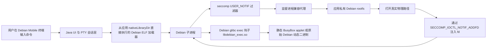

# Debian Mobile

     

[English](README.md) | **简体中文**

Debian Mobile 在一个普通的、无特权的 Android 应用沙盒里运行真正的 Debian Bullseye（ARM64）用户态。不需要 Root，不用 PRoot，不把 ptrace 作为运行时核心，没有虚拟机，也不改内核：只有一个 Android 应用、一个 seccomp `USER_NOTIF` 监督进程，和一套被小心翼翼调解着的、放在应用私有目录里的 Debian rootfs。

这件事有趣的地方不是"把 Debian 目录解压到手机上"，任何人都能做到这一点。有趣的地方在于：Debian 进程坚信自己活在 `/usr/bin`，而内核坚持认为它活在 `/data/user/0/<package>/files/debian/usr/bin`，双方都不肯让步。Debian Mobile 用一层刻意保持轻薄、可审计、并对自身边界诚实的兼容层化解了这场对峙：监督进程拦截选定的路径类系统调用，把 Debian 的逻辑路径翻译成应用私有 rootfs 里的物理路径，再把文件描述符注回 Debian 子进程。Android 继承下来的安全策略，包括 OEM 出厂的每一条 `KILL` 规则，原封不动地继续生效。我们把这当作特性，而不是障碍。

本 README 中的每一项声明都有真机退出码背书。没有被列为"已验证"的功能，请默认它没有被验证。这条纪律让我们付出了 90 个 Part 的调试代价，也是本项目产出的最可复用的东西。

## 目录

- [这是什么](#这是什么)
- [已验证能力](#已验证能力)
- [工作原理](#工作原理)
- [安全模型与非目标](#安全模型与非目标)
- [安装与使用](#安装与使用)
- [那些硬骨头](#那些硬骨头)
- [已知限制与诚实边界](#已知限制与诚实边界)
- [验证哲学](#验证哲学)
- [开发历程](#开发历程)
- [路线图](#路线图)
- [贡献指南](#贡献指南)
- [开源协议](#开源协议)
- [商标](#商标)
- [上游血统](#上游血统)

## 这是什么

Debian Mobile 是一个面向受限 Android 应用域的实验性、轻量 Debian ARM64 运行时。它从应用的 `nativeLibraryDir` 直接执行一个 Debian ELF 加载器（Android 允许应用执行这类文件），然后调解选定的绝对路径操作，让 Debian 用户态能够对准存放在应用私有目录下的 rootfs 工作。

与常见方案对比：

| 方案 | 如何伪造 `/` | Debian Mobile 的替代做法 |
|---|---|---|
| Root + `chroot` | 内核级命名空间切换 | 拒绝：需要 Root |
| PRoot | `ptrace` 系统调用改写 | 拒绝：ptrace 作为运行时核心又慢又脆，在 OEM 内核上不可靠，且违反项目原则 |
| Termux 式原生前缀 | 不是 Debian；软件包针对 Android bionic 重建 | 我们运行真正的 Debian Bullseye rootfs 和官方 `.deb` 包，不做修改 |

终端 UI 源自官方 Termux v0.118.3 代码库，针对本运行时做了适配。这个应用首先是一个终端，不是一个兼容性噱头：PTY 会话、作业控制、回滚缓冲区和 alternate-screen TUI 行为都是一等公民。

### 范围声明

Debian Mobile 是一个带边界兼容层的终端运行时。它不是通用容器，不是 Root 工具，不是安全绕过，也不是完整的 Termux 替代品。能用的命令集合，恰好等于下面列出的已通过真机验证的集合。

## 已验证能力

目标环境：Android 16（HyperOS 3）、AArch64、SELinux `untrusted_app_27`。下表每一行都有真机 exit 0 记录在案。

| 能力 | 证据 |
|---|---|
| 带路径虚拟化的 Debian shell（`/bin`、`/usr`、`/lib`、`/etc` 以逻辑 Debian 路径可见） | 自首个 MVP 起验证，每轮回归复验 |
| 基础命令：Debian Bash、精选静态 BusyBox applet、`hello`、`curl --version`、`nano --version` | 真机验证 |
| 受控 Debian 包管理：`apt update`、`apt install -y gcc`、`hello`、`curl`、`nano`、`apt --fix-broken` | 真机验证，含 GCC 工具链路径 |
| PTY 会话与作业控制：前台进程回收、提示符恢复、Ctrl+C | 通过唯一的高号 `ALLOW`（`wait4(260)`）实现，真机验证 |
| 基础 TUI alternate-screen 行为（BusyBox `vi` 进入与 `:q!` 退出，主屏内容完好） | 真机验证 |
| 应用内自检：18 项 Validation 套件 | 多次 18/18 PASS 记录 |
| 用户自带 musl Node 22 最小入口：`node --version`（v22.23.2）、一段运行中的 JS 单行脚本、`npm --version`（10.9.8） | 真机验证；实验性、用户自行导入、不随包分发。见[案卷 3](#案卷-3node-之墙与-musl-弯路) |

明确未验证、也绝不声明的：完整 GNU coreutils 覆盖、任意网络可达性、完整 xterm 兼容终端、超出最小命令的 Node/npm 生态，以及 opencode（该实验在完成前已被冻结，见[冻结线说明](#案卷-7冻结线opencode)）。

## 工作原理



### 入口：直接执行加载器

Android 允许应用执行打包在 native library 目录里的 ELF。Debian Mobile 把这一点用作唯一被认可的入口：Debian 的 AArch64 动态加载器作为应用库打包并被直接执行。不从 `memfd` 运行任何东西，也从不把 Android 侧的任意 ELF 当作 Debian 来执行。

### 通过 seccomp USER_NOTIF 做路径虚拟化

Debian 子进程安装一个对 18 个路径与身份相关系统调用生效的 `SECCOMP_RET_USER_NOTIF` 过滤器。当子进程触发其中之一，内核会把它挂起，把请求交给监督进程，后者：

1. 把逻辑 Debian 路径（例如 `/etc/passwd`）解析到物理 rootfs（`<应用文件>/debian/etc/passwd`）。
2. 在应用私有 rootfs 内执行真实操作，遵守受控写白名单。白名单之外的一切诚实地返回 `EROFS`。
3. 对 `openat` 类调用，打开真实文件并用 `SECCOMP_IOCTL_NOTIF_ADDFD` 把描述符装入子进程，然后恢复执行。

被调解的系统调用集合（AArch64 编号）：`mkdirat(34)`、`unlinkat(35)`、`symlinkat(36)`、`renameat(38)`、`statfs(43)`、`faccessat(48)`、`fchmodat(53)`、`fchownat(54)`、`fchown(55)`、`openat(56)`、`readlinkat(78)`、`newfstatat(79)`、`fstat(80)`、`utimensat(88)`，以及服务于 fakeroot 身份呈现的 `getuid(174)`/`geteuid(175)`/`getgid(176)`/`getegid(177)`。

相对路径直通：子进程的工作目录本来就在 rootfs 之内，`./configure` 根本不需要翻译。

### exec 分流与垫片

`execve(221)` 刻意不被调解。exec 时刻的翻译发生在用户态，由一个针对 Debian Bullseye glibc 构建的 `LD_PRELOAD` 钩子（`libdebian_exec.so`）完成：

- 动态 ELF：分派到物理 Debian 加载器。
- 无 `PT_INTERP` 的 ELF（静态 PIE，例如 `ldconfig`）：直接 `execve`。
- shebang 脚本：解释器映射到物理解释器路径。
- 一份经过审计的小名单：分派给已验证的静态 BusyBox。

第二个垫片 `noshm3.so` 负责消灭三个在本环境无法存活的系统调用（见[案卷 1](#案卷-1三只耗子与一个垫片)）。它对 System V IPC 与 io_uring setup 返回诚实的 `ENOSYS`，对 `getrandom` 则通过完整读取真实的 `/dev/urandom` 来服务。永远没有假成功，永远没有弱随机。

### fakeroot，诚实的那种

Debian 工具链期待 `root`。监督进程对身份查询呈现 uid/gid 0，对 `fchown` 类调用返回成功而不改动真实 inode；`utimensat` 先尝试真实操作，仅在真实结果为许可类错误时才伪成功。这是为兼容性服务的身份呈现，不是提权：真实 UID、SELinux 标签和继承的 seccomp 策略都原封未动。

### 终端层

每个会话拥有一个真实 PTY（`posix_openpt`、`setsid`、`TIOCSCTTY`、`tcsetpgrp`），配 24x80 canonical+ISIG termios。Java 侧实现了一个有界的 VT 屏幕：CSI 序列、16/256 色 SGR、回滚缓冲、alternate screen、触摸滚动，以及含 Esc 在内的原始按键直通。前台作业回收依赖 `wait4(260)`，它是整个 BPF 程序里唯一一个高号 `ALLOW`。这个例外有明确的理由，在贡献规则中不可协商。

## 安全模型与非目标

安全姿态刻意是单向的：Android 的规则永远赢。

| 规则 | 含义 |
|---|---|
| 无 Root、无 PRoot、无 AVF、不改内核 | 运行时完全活在一个普通应用的权限之内 |
| 绝不修改继承的 seccomp | OEM 的 `KILL` 动作无法被后装规则削弱，我们也不尝试 |
| 不新增高号 `ALLOW` | `wait4(260)` 是唯一一个，为作业控制而存在 |
| 诚实的 `ENOSYS` | 不支持的系统调用按不支持失败，绝不伪造成功 |
| 受控写面 | 写操作只落在应用私有 rootfs 的白名单路径，其余一律 `EROFS` |
| 不内置 Node、npm、opencode 或任何第三方业务工具 | 用户可自担风险导入自己的二进制，见冻结线说明 |

介绍本项目时，准确的措辞是："在应用私有 rootfs 内，通过 seccomp `USER_NOTIF` 进行路径调解与受控 fd 注入"。不准确的措辞，包括"绕过 Android 沙盒""Root 了""完整 chroot"，请大家避免使用。

## 安装与使用

从 [v0.1 发行版](https://github.com/leiqiaoyu/debian-mobile/releases/tag/v0.1) 安装发行 APK：`debian-mobile-v0.1-arm64-v8a.apk`，SHA-256 `b8c6ae5cf6be04511e5ba13d1e66c0c88a7480d5bdf7226c0f2dc8a8ffa4dfc0`。

v0.1 是经过真机验证的 Part58 构建，并完成了发布卫生处理：移除 debug 标记、权限从 15 项收敛到 8 项、禁用外部命令 API、更换全新签名密钥。由于签名密钥已轮换，安装前请先卸载旧的开发版——应用使用 `sharedUserId`，Android 会拒绝跨签名的覆盖升级。

互通文件夹（Android 侧 `/storage/emulated/0/Debian-mobile`，Debian 侧 `/mnt/sdcard`）保留；安装后在系统设置中为应用开启一次"所有文件访问"，桥接即按 Part58 的方式工作。

### 环境要求

- Android 16+ 设备，AArch64，最好属于已测试的设备类别（HyperOS 3，`untrusted_app_27` 域）。其他 OEM seccomp 策略下的行为无法保证，这是设备相关的。
- 数百 MB 应用私有存储空间用于 rootfs。
- 不需要任何特殊权限。这正是意义所在。

### 首次运行

1. 安装 APK 并启动应用。首次启动会把 Debian Bullseye ARM64 rootfs 解包并校验到应用私有存储。
2. PTY 会话中出现 Bash 提示符。基础路径虚拟化已经生效：`ls /usr/bin`、`cat /etc/passwd`。
3. 打开 Validation 页面运行 18 项套件。18 项全过之前，其他任何尝试都不值得。
4. 已验证的包管理路径：

```console
$ apt update
$ apt install -y hello curl nano
$ hello
$ curl --version
$ apt install -y gcc
```

上面每一条命令都有真机 exit 0 记录。名单之外的命令也许能跑，只是没有被验证过，相关 issue 请照实说明。

### 关于 Node.js

Debian Mobile 不内置 Node.js，也不承诺它。官方 glibc 版 Node 在已测设备类别上死于继承 seccomp（见[案卷 3](#案卷-3node-之墙与-musl-弯路)）。一套用户自行导入到 `/usr/local/node-musl` 的 musl Node 22，经运行时的精确加载器分流调度，已在目标设备上通过最小命令（`node --version`、一段 JS 单行脚本、`npm --version`）。这被记录为分流机制的实验性能力，而不是一个受支持的 Node 平台：完整 npm 生命周期与全局包安装仍未验证，而且已知会踩进下面案卷描述的若干雷区。

## 那些硬骨头

README 的这一部分是我们真正引以为豪的部分。下面每个案卷都遵循同一格式：我们看到了什么，我们起初错误地相信了什么，真相是什么，以及幸存下来的教训。这些是工程案卷，不是功能声明；其中几案的结局是"冻结、未完成"，我们也照实写。案卷讲完整故事；全部雷区的一句话速查版另见[避坑指南](docs/pitfalls.md)。

### 案卷 1：三只耗子与一个垫片

**症状。** Node 22 启动即死，`Bad system call`，退出码 159（`SIGSYS`）。没有输出，没有 core，没有解释。换不同 Node 版本重复实验毫无变化，这是第一个提示：问题不在 Node。

**误导项。** 下载损坏。架构选错。glibc 符号不匹配。全错，而且每一个都耗掉一轮往返。

**根因。** 三个互不相干的系统调用，个个致命，且毙命于不同的权威：

| 系统调用 | 编号 | 谁毙的 | Node 为何踩中 |
|---|---|---|---|
| `shmget` | 194 | Android 继承 seccomp（`KILL`） | V8/ICU 启动时探测 System V IPC |
| `getrandom` | 278 | 我们自己的 BPF（`>=260` 守护，返回 `ENOSYS`） | 加密与 UUID 初始化 |
| `io_uring_setup` | 425 | Android 继承 seccomp（`KILL`） | libuv 探测 io_uring |

第一个和第三个来自 OEM 策略层，后装的 BPF 无法推翻：内核一旦对某系统调用有了 `KILL` 动作，后续过滤器只能更严，不能更松。第二个则是我们自己高号守护规则的自伤。

**修复。** 一个预加载垫片，`noshm3.so`，一击三杀：对 `shmget` 返回 `ENOSYS`（诚实：System V IPC 就是不存在），对 `getrandom` 通过完整读取真实 `/dev/urandom` 来服务（绝不弱回退，绝不假成功），对 `io_uring_setup` 返回 `ENOSYS` 让 libuv 退回 epoll 路径。Node 另以 `UV_USE_IO_URING=0` 运行，双保险。

**教训。** 无输出的 `SIGSYS` 几乎总意味着某个系统调用在用户态来得及抱怨之前就死了。先枚举受害者的系统调用面，再怪罪二进制。另外，`LD_PRELOAD` 垫片只能拦 libc 函数调用，救不了直接发裸 `svc` 指令的程序（这一条会在[案卷 7](#案卷-7冻结线opencode)作为限制再次出现）。

### 案卷 2：ABI 惨案

**症状。** 一次例行重构建之后，所有普通 Debian 会话启动即退。不是部分命令挂，是全部命令、瞬间、集体阵亡。

**根因。** `libdebian_exec.so` 预加载钩子被用 Android NDK 重编了，产出 bionic ABI 的二进制，然后被预加载进 Debian glibc 进程。两个 ABI 世界在同一个地址空间相遇，输家是会话本身。

**修复与永久规则。** 跑在 Debian 进程里的钩子必须用 Debian Bullseye 的 glibc 工具链构建，`NEEDED` 条目只允许 `libc.so.6` 与 `ld-linux-aarch64.so.1`。NDK 只构建 Android 侧代码，永远不构建加载进 Debian 的代码。肇事产物被永久退役，这条规则现在是贡献门槛。

**教训。** 在双运行时架构（Android 应用加 Debian 用户态）里，"能编译"不能证明任何事。你链接的 ABI 就是你必须活下去的 ABI。

### 案卷 3：Node 之墙与 musl 弯路

**症状。** 所有官方 Node 构建（glibc 链接）都像案卷 1 一样死亡。系统性真机探测后的裁定：V8 与 libuv 依赖的一整类系统调用被继承 seccomp 列入 `KILL`，任何用户态层都无法降低该优先级。官方 Node/npm 路线在这个设备类别上被彻底关闭。

**弯路。** musl 链接的 Node 避开了部分 glibc 启动路径，配上 `noshm3.so` 之后能活。但它带来自己的约束：musl 进程不能预加载 glibc 钩子，也不能从父进程继承带 glibc 味道的 `LD_PRELOAD`/`LD_LIBRARY_PATH`，否则两个世界会像案卷 2 那样相撞。

**修复。** 精确分流：当 exec 命中用户导入的 musl Node 树的精确物理路径（`/usr/local/node-musl/...`）时，运行时剥掉所有继承的加载器变量，再注入 musl 加载器、`noshm3.so` 与 `UV_USE_IO_URING=0`。裸 `node --version` 返回 `v22.23.2`，一段 JS 单行脚本跑通，`npm --version` 返回 `10.9.8`，全部真机 exit 0。普通 Debian 路径完全不受这条分流影响。

**教训。** 两个 libc 世界要共存，隔离就必须在每个进程边界上显式声明：继承来的环境是状态，而状态是 bug 的载体。另一条：最小命令通过，只是关于分流机制的一个数据点，不是关于整个生态的承诺，这就是能力表里那一行被标注"实验性"的原因。

### 案卷 4：chdir 的谎言

**症状。** npm 的生命周期 spawn 失败，报 `spawn sh ENOENT`。最自然的解读：shell 丢了。并不是；`/bin/sh` 好好地在，直接调用也能跑。

**根因。** npm 在 spawn 之前会先 `chdir` 进包目录。它拿到的目录是个逻辑 Debian 路径，作为物理路径在内核里根本不存在。`chdir` 失败，npm 把它包装成一个关于 spawn 的误导性 `ENOENT`，于是所有人都盯着错误的文件看。

**修复。** 在所有承重位置给 npm 物理路径：`npmrc` 里的 `prefix`、`cache`、`script-shell` 全部指向应用私有 rootfs 下的真实位置。spawn 报错消失，因为它从来就和 spawn 无关。

**教训。** 在路径翻译环境里，错误消息描述的是最后一次失败，不是第一次。`cwd` 和 `PATH` 是承重结构；进程死在启动阶段时，先审计它想进入什么，再审计它想执行什么。

### 案卷 5：execvp 漏斗

**症状。** 在 `ETXTBSY` 调查（下一案卷）期间，报错持续指向一个我们能证明完全正常的 wrapper 脚本，而真正的二进制根本没有被执行。

**根因。** 经典的 `execvp` 语义，外加一层沙盒变形。对 `execvp` 来说 `ENOENT` 是"继续找"的裁决：第一个 `PATH` 候选失败于 `ENOENT`，它就试下一个。关键在于，ELF 解释器缺失（`PT_INTERP` 指向一个打不开的路径）同样以 `ENOENT` 面目出现。而 `ETXTBSY` 是终止性的，搜索停止并上报。

于是真实序列是：真二进制的解释器路径解析失败（`ENOENT`，静默，继续搜索），搜索走到一个被锁住的 wrapper 文件，锁住的文件产生 `ETXTBSY` 并被上报。错误指认了一个完全错误的嫌疑人。

**教训。** `execvp` 报出离奇错误时，被点名的文件是最后一个候选，不是预期的那个。`PT_INTERP` 缺失伪装成"文件不存在"，而且伪装是静默的。

### 案卷 6：ETXTBSY，或一个丢失的 close()

**症状。** `npm install` 走到 postinstall，死于 `sh: node: Text file busy`。`ETXTBSY` 的教科书含义是"有人正在执行这个文件"。没有人正在执行。

**误导项。** 并发的 watcher。残留的 npm 守护进程。类杀毒扫描。每个假设都被检验并阵亡；一个 inode 置换的绕法（写新文件再 `rename` 盖住旧路径）能让症状搬家，这成了关键线索：文件是被"持有"，不是被"执行"。

**根因。** 我们自己的监督进程。`openat` 的 `USER_NOTIF` 处理器在本地打开真实文件，再用 `SECCOMP_IOCTL_NOTIF_ADDFD` 注入子进程。内核把描述符复制给子进程，但监督进程的本地副本从未被关闭。于是 Debian 进程的每次写打开都额外泄漏一个写句柄，由监督进程握着，直到它生命的尽头。若干轮 `npm` 之后，监督进程手里攥着一把写锁，锁的恰好是 postinstall 想执行的 `node` wrapper。`ETXTBSY` 这次难得说了实话：文件确实忙，只是忙的人不是执行者。

**修复。** 一行代码：`ADDFD` ioctl 之后 `close(local_fd)`。整整一类泄漏随之消失。

**教训。** 在 fd 注入设计里，注入者的记账是契约的一部分；交给内核的描述符在你关闭之前仍然属于你。当一个经典错误看似不可能时，把架构里每个长命进程的 `/proc/<pid>/fd` 扫一遍，胜过任何理论推演。防御性手法（先写临时路径再 `rename` 完成 inode 置换）也从此永久进驻工具箱。

### 案卷 7：冻结线（opencode）

这一案没有以胜利收场，而这正是它被记录下来的原因。

**症状。** Node 与 npm 最小化存活之后，安装 opencode（一个 Bun 构建、经 npm 分发的动态链接平台二进制）撞上了一条传送带式的失败流水，每一段失败都是真实的，且没有一段是最后一段：一个看似空空如也的包缓存（其实是我们自己取证工具的扫描 bug，读 npm `cacache` 索引格式时埋了两个不同的 bug）、一个被遗留影子目录污染的 `PATH` 上 `tar` 解析、一份被派生 npm 调用无视转而投向默认缓存位置的 `npmrc`、一次 musl/glibc 平台包错配，以及一个猜错 glibc 加载器文件名的 wrapper。

这条线上有两个发现，无论其命运如何都值得留下。第一，npm 的 libc 探测读的是 `PATH` 上的 `ldd`；在 Debian 上它读到 "GNU C Library"，于是正确地选择了 glibc 平台包，所以"装错包"这个假设本身就是错的。第二，AArch64 上 glibc 加载器链条经 `ld-linux-aarch64.so.1` 终结于 `ld-2.31.so`；`.so.2` 后缀是 x86_64 的习惯，在这里根本不存在，而猜错后缀会经案卷 5 的 execvp 漏斗产出 exit 127。

这条线还留下一个更深的结构性事实，已被计入未来所有计划：内核加载 `PT_INTERP` 解释器是内核内部的 open，从不经过用户态 `openat`，所以 seccomp 调解永远看不见、也无法翻译解释器路径。任何解释器写成逻辑 Debian 路径的动态链接二进制，都必须包一层 wrapper 显式调用物理加载器。而直接发裸 `svc` 做 io_uring 的静态二进制，`LD_PRELOAD` 完全够不着；唯一已知解法是二进制补丁，本项目对此有先例（把 `io_uring` 调用改写为 `ENOSYS`）。

**状态。** 这条线的提取与 wrapper 脚本已经写好并经过评审，但被刻意地从未执行；路线冻结，精力转向开源。任何版本的 opencode 都从未在这里跑通过，本项目的一切内容都不应被解读为相反的声明。

**教训。** 有些墙是承重墙。精确地画出哪些失败类别在兼容层内可修（路径、fd 泄漏、加载器路由），哪些不可修（继承的 `KILL` 优先级、内核内部的解释器打开、静态二进制的裸 `svc`），这本身就是一份交付物。

## 已知限制与诚实边界

1. **设备相关。** 上述一切验证于 Android 16 / HyperOS 3 / AArch64 / `untrusted_app_27`。其他 OEM seccomp 策略可能毙掉不同的系统调用；兼容性无法被承诺，这一点是设计使然。
2. **继承的 `KILL` 无法削弱。** 如果 OEM 策略毙掉了你的工作负载需要的系统调用，本项目不能也不会靠加白名单或伪造成功来"修复"。
3. **io_uring 是诚实降级的。** `io_uring_setup` 返回 `ENOSYS`，libuv 回退到 epoll。功能保留，吞吐略降。
4. **裸系统调用的静态二进制够不着。** Bun/Zig 式直接发 `svc` 的静态二进制无法被 `LD_PRELOAD` 垫住，唯一已知解法是二进制补丁。
5. **Node/npm 是实验性的、用户自带的、不随包分发的。** 最小命令通过；完整生命周期尚未通过。opencode 已冻结、未验证。
6. **终端是有界的 VT 实现**，针对已验证路径（BusyBox `vi` 的 alternate screen）验证，不是完整的 xterm 模拟器。
7. **网络取决于目的地。** DNS 与受限 TCP/HTTP 探测已验证；任意外部可达性取决于设备代理与系统策略，不做承诺。
8. **没有任意可写文件系统。** 写操作白名单限于应用私有 rootfs 路径；其余一律 `EROFS`，包括 Debian 工具链有时会期待可写的路径（这是刻意划定的边界，记录在开发历程中）。

## 验证哲学

本项目的每个声明有四个证据等级，等级决定它能出现在哪里：

| 等级 | 含义 | 能否用作功能声明 |
|---|---|---|
| A | 真机，真实 exit 0，输出与语义相符 | 可以，并注明设备与版本 |
| B | 真机失败（非零退出、`SIGSYS`、崩溃） | 只能作为限制或已知问题 |
| C | 离线/静态审计（ELF 头、哈希、反汇编、APK 解包） | 证明构建属性，永远不证明运行行为 |
| D | QEMU 或宿主侧辅助 | 解释机制，对设备什么也不证明 |

项目历史上包含一个已被否决的做法，我们把它公开留作警示：早期有一版测试逻辑靠匹配输出文本来判 PASS。那套逻辑是错的，已被禁止；退出码与存档的原始输出才是唯一通货。每张对外测试表都应携带设备、APK 哈希、命令、输出摘要、退出码，以及真机或离线的标签。

## 开发历程

九十一个台阶，压缩成承重的里程碑：

| 阶段 | Part | 发生了什么 |
|---|---|---|
| MVP | 1–2 | seccomp notify 基线探针；直接加载器入口；`USER_NOTIF` 路径代理；静态 BusyBox 分派；首个真机验证的 shell |
| 可用的终端 | 3–6 | PTY 作业控制与 `wait4(260)` 例外；`vi` 的 VT alternate-screen 修复；18 项 Validation 达成 18/18 |
| 让 apt 变真 | 7–14 | apt/dpkg 分阶段审计；usrmerge 桥接（`/bin` 到 `/usr/bin` 别名）；alternatives 与 dpkg 临时路径处理；按包逐条收窄的谓词修复 |
| 撞上 Node 之墙 | 15–33 | 反复的官方 Node 导入尝试；系统调用探测；裁定官方 Node 路线在此设备类别上关闭 |
| 诚实 ENOSYS 时代 | 34–47 | musl Node 候选；System V IPC `ENOSYS` 垫片；CSPRNG 取证工作；随机数永远只来自真实 `/dev/urandom` 的原则 |
| 稳定基线 | 48–51 | GCC 符号链接与 alternatives 修复；`apt install -y gcc` exit 0；Validation 18/18；第一个具备发布素质的基线 |
| ABI 一课 | 52–53 | NDK 构建钩子惨案，以及"预加载钩子只认 Debian glibc"的永久规则 |
| Node，最小化地，活着 | 54–58 | 冻结 runtime 加 `noshm3.so`；精确 musl 加载器分流；裸 `node`/`npm` 最小通过；Java 侧 `npmrc` 物理路径恢复 |
| 生命周期迷宫 | 59–71 | `spawn sh ENOENT` 揭穿为 `chdir` 失败；execvp 漏斗理论；`ETXTBSY` fd 泄漏调查与它的一行修复 |
| 影子与加载器 | 72–88 | 影子 wrapper 战术；物理路径免疫的发现；`ADDFD` 泄漏机制定案；`PT_INTERP` 内核不可见性被证实；AArch64 加载器链条与 tar 真身落定 |
| 冻结 | 89–90 | 提取与 wrapper 脚本完成编写与评审，并被刻意地未执行；opencode 路线冻结；精力转向开源 |

完整的逐 Part 日志（脱敏版）计划以 `docs/development-history.md` 形式进入本仓库。

## 路线图

1. 发布卫生——0.1 APK 已完成：权限与组件审计（[docs/permission-audit.md](docs/permission-audit.md)）、完整 APK 审计（[docs/apk-audit-v0.1.md](docs/apk-audit-v0.1.md)）、带 SHA-256 溯源与轮换签名密钥的唯一发行 APK。源码树脱敏将增量推进；19 GB 开发工作区刻意不公开。
2. 在发行构建上对整个已验证矩阵做真机回归，原始输出归档。
3. `docs/development-history.md`：完整、脱敏的 90-Part 日志，作为独立的调试叙事。
4. 可选，且仅在上面的完成之后：带着已经建立的 wrapper 纪律，重新审视冻结的 Node/opencode 路线。

## 贡献指南

欢迎在项目纪律之下贡献，纪律很短，但很严：

- 没有证据就没有发生。声称行为的 PR 必须附带设备、命令、原始输出与退出码。匹配输出文本不算测试。
- 永远不新增高号 `ALLOW` 系统调用。`wait4(260)` 是唯一一个，理由是作业控制。
- 不提交会被加载进 Debian 进程的 NDK/bionic 产物。预加载钩子永远针对 Debian Bullseye glibc 构建。
- 不伪造成功。不支持就是 `ENOSYS`，部分支持就写文档，随机数只能来自 `/dev/urandom`。
- 窄规则优先于宽规则。一条路径谓词修好一个包的失败；一个放宽整目录权限的改动，看一眼就会被拒绝。

Issue 请包含：设备型号与 Android/OEM 版本、精确命令、完整 stderr、退出码。"不好使"而不带退出码的 issue 会被以不完整证据为由关闭，态度会很客气。

## 开源协议

**整体分发作品采用 GPL-3.0-only**（`SPDX-License-Identifier: GPL-3.0-only`）。

这是衍生关系的事实认定，不是偏好选择：终端 UI 与会话层源自 Termux v0.118.3，其许可证文件（`termux_01183_full_ui/LICENSE.md` 与 `termux-shared/LICENSE.md`）均为 GPLv3-only。GPLv3-only 代码的衍生作品不能以更弱的许可证整体发布，因此本仓库与每一个发行版 APK 的根许可证都是 GPL-3.0-only，原创贡献也按同一条款接收。

全文见 `LICENSE`，上游署名清单（Termux 血统、terminal-view/terminal-emulator 组件、AndroidX/Material/Kotlin 运行时依赖、Debian rootfs 再分发说明）见 `NOTICE`。把源码树改标 MIT 或 Apache-2.0 不在选项之内；尝试这么做的贡献会被拒绝。

## 商标

Debian 与 Debian 漩涡标志是 Software in the Public Interest, Inc. 的商标。本应用的启动器图标为 Debian 漩涡，版权所有 (c) 1999 Software in the Public Interest, Inc.，按 Debian 开放使用标志许可（LGPL-3.0-or-later 或 CC-BY-SA-3.0，二选一）署名使用，详见 `NOTICE`。

Debian Mobile 与 Debian 无隶属关系。Debian 是 Software in the Public Interest, Inc. 拥有的注册商标。

## 上游血统

- **Termux**（v0.118.3）：终端 UI 与会话层的前身。本项目深受其惠，其许可证义务被认真对待而非挥手放过。
- **Debian**（Bullseye，ARM64）：rootfs，以及让这一切值得做的每一个 `.deb`。Debian 及其商标政策受到尊重；本项目与 Debian 无隶属关系。
- **BusyBox**：已审计命令集的静态 applet 后盾。
- **musl libc**：让一个活着的 Node 在这个设备类别上成为可能的那个弯路。

Debian Mobile 是一个独立的实验性项目。它与 Debian、Termux 或任何 OEM 均无隶属、背书或认可关系。
