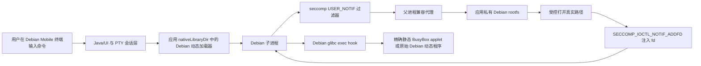

# Debian Mobile：开源 README 撰写资料包

> **用途。** 本文是交给“超级外援”撰写开源 README 的事实资料包，而不是对外 README、安装说明或发行公告。它汇总工作区可追溯的 Part 记录、冻结工件、真机验收、架构约束和未解决问题；所有功能性结论必须以**Android 真机原始输出及退出码**为准，QEMU 仅可说明机制，不能替代真机裁决。
>
> **撰写纪律。** 对外 README 应只陈述本文标记为“真机已通过”的能力；“候选”“历史”“冻结”“停止”均不可包装成已交付功能。任何 README 发布前都必须重新核对最终 APK、源码与本资料包的 SHA-256。
>
> **引用规则。** 本文各项事实均可追溯至第 13 章列出的内部原始证据；在公开仓库中，README 应以相对链接引用经脱敏、可公开的对应文档。若主张无法回链到真机原始记录、APK 审计或源码审计，就必须从 README 的“已验证”表格中删除。
>
## 目录

1. [项目身份与范围](#1-项目身份与范围)
2. [不可违反的安全与工程约束](#2-不可违反的安全与工程约束)
3. [当前可信能力、禁止宣传项与版本冲突](#3-当前可信能力禁止宣传项与版本冲突)
4. [总体架构](#4-总体架构)
5. [验证哲学与证据等级](#5-验证哲学与证据等级)
6. [全 Part 历程索引](#6-全-part-历程索引)
7. [稳定基线、冻结工件与哈希](#7-稳定基线冻结工件与哈希)
8. [Node、npm 与 opencode 支线（已冻结）](#8-nodenpm-与-opencode-支线已冻结)
9. [已知问题、淘汰路线与不应承诺的事项](#9-已知问题淘汰路线与不应承诺的事项)
10. [源码、APK、文档与审计材料索引](#10-源码apk文档与审计材料索引)
11. [README 建议结构与推荐表述](#11-readme-建议结构与推荐表述)
12. [开源前必做审查清单](#12-开源前必做审查清单)
13. [本资料包的主要内部依据](#13-本资料包的主要内部依据)

---

## 1. 项目身份与范围

| 项目 | 事实 |
|---|---|
| 用户可见名称 | **Debian Mobile** |
| Android applicationId | **`com.debian.runtime`**；不得修改。 |
| 目标环境 | Android 16、HyperOS 3、AArch64、SELinux `untrusted_app_27`。 |
| 产品目标 | 在普通 Android 应用私有目录中提供一个**无 Root 的 Debian ARM64 轻量运行时**及交互式终端，而不是通用虚拟机、chroot、PRoot 容器或完整 Termux 替代品。 |
| Debian 基础 | Debian Bullseye ARM64 rootfs；路径以应用私有目录下的 `files/debian` 为真实落点。 |
| 成功裁决 | 真实 Android 设备的进程退出码、信号和原始输出；**只有 exit=0 才能标为 PASS**。 |
| 非目标 | Root、PRoot、ptrace 作为运行核心、AVF、内核修改、绕过 Android/OEM 继承 seccomp、捆绑 Node/opencode 等第三方业务工具。 |

项目的关键价值不在于“把一个 Debian 目录解压到手机”，而在于在 Android 应用受限域中建立一个**有边界、可审计的兼容层**：Debian 动态加载器从可直接执行的应用 native library 目录启动；受控的 seccomp USER_NOTIF 父进程将 Debian 进程看到的绝对路径映射到应用私有 rootfs；同时保留 Android 原有安全策略的强制力。

---

## 2. 不可违反的安全与工程约束

### 2.1 永久红线

| 类别 | 约束 |
|---|---|
| 权限与隔离 | 不使用 Root、PRoot、AVF；不把 ptrace 作为核心机制；不改 Android 内核。 |
| seccomp | **不修改继承的 Android/OEM seccomp**；不能试图用后安装的规则覆盖已存在的 KILL 行为。 |
| BPF | `wait4(260)` 是唯一高号 `ALLOW` 例外；不得新增高号 `ALLOW`，不得把禁止调用伪装为成功。 |
| 兼容垫片 | System V IPC 和 io_uring 相关调用只能诚实返回 `ENOSYS`；随机数只能在完整读取真实 `/dev/urandom` 成功后成功返回，禁止弱随机、计数器、固定字节或伪成功。 |
| 发行真实性 | 不可将静态审计、QEMU、Android 宿主侧下载/解压或“输出看起来正常”当作运行成功；不得宣传未做过真机 exit-code 验收的能力。 |
| Node | 不内置 Node 资产；用户可自行导入其 Node。Node/npm/opencode 的后续支线当前已被用户**显式冻结**。 |
| 构建 ABI | 供 Debian 进程预加载的 `libdebian_exec.so` 必须保持 Debian glibc ABI；不得使用 Android NDK/bionic 重编替换。 |

### 2.2 安全设计的公开表述边界

对外 README 可以说“项目使用 seccomp USER_NOTIF 对特定路径访问实行父进程代理和受控 fd 注入”。不要宣称项目“绕过了 Android 沙盒”“获得了 Root”“实现了完整 chroot”，也不要把受控的 fakeroot 身份呈现表述为 Android 系统提权。对外文案还应明确：继承 seccomp 的 KILL 优先级不能由本项目降低，这是本项目主动尊重的安全边界。

---

## 3. 当前可信能力、禁止宣传项与版本冲突

### 3.1 可在 README 中作为“已真机验证”候选的能力

| 能力 | 当前证据 | 安全表述建议 |
|---|---|---|
| Debian shell 与路径可见性 | Part2 起已实机验证 `/bin`、`/usr`、`/etc` 映射；后续多轮验证保持。 | “在受控路径映射下运行 Debian shell。” |
| 基础命令和交互式终端 | Bash、静态 BusyBox applet、`hello`、`curl --version`、`nano --version` 有真机通过记录。 | “基础命令和交互终端在目标机型完成验证。” |
| PTY 作业控制 | Part5 通过保留 `wait4(260)` 处理前台作业回收与提示符恢复。 | “支持受控 PTY 会话与前台作业恢复。” |
| TUI alternate screen | Part6 对 BusyBox `vi` 的进入与 `:q!` 返回进行了真机修复与验证。 | “针对 BusyBox vi 已验证基础 alternate-screen 恢复。” |
| Debian 包管理/GCC | Part51：`apt install -y gcc`、`hello`、`curl`、`nano`及应用内 Validation 18/18 均通过；后续 Part54 普通会话也通过这些回归。 | “已在目标机验证受控 Debian 包管理和 GCC 安装路径。” |
| 应用内自检 | Validation 页面运行 18 项检查，已有多次 **18/18 PASS** 记录。 | “内置 18 项设备内回归检查；最终发布需随 APK 再现验证。” |
| 用户自带 musl Node 的最小入口 | 后续 Part55/56/58 资料及真机用户记录显示裸 `node --version`、Node JS 和 `npm --version` 曾成功。 | 仅在最终可复现并审计后表述；不得把这自动扩大为 Node 生态或 opencode 可用。 |

### 3.2 绝对不可宣传为当前完成的能力

| 项目 | 真实状态 |
|---|---|
| 所有 GNU coreutils 完整可用 | 未证明。早期稳定做法是 Debian Bash + 精确分派到静态 BusyBox 的少量 applet，不是恢复全部 GNU 用户态。 |
| 通用网络可用 | Part4 证明部分 UDP DNS、受限 TCP/HTTP 探针可用；外部目的地仍可能受系统/代理影响。不能写成“任意网络均可用”。 |
| 完整 xterm/Termux 替代 | 当前是有范围的自定义 VT，实现按真实需求修复，不是完整终端模拟器。 |
| 通用官方 Node/V8/npm | Part31/33/38 曾证实多条 Node/npm 路径会被继承 seccomp 以 SIGSYS/159 终止。后续用户自带 musl Node 的局部进展也不能覆盖这一设备类边界。 |
| opencode | **未完成安装或版本运行。** 最新路线已冻结，任何 README 均不得声称支持、捆绑或验证 opencode。 |
| 完整安全发布 | 尚未完成源码脱敏、许可证核验、最终 APK 再构建、UI 双语审查、公开仓库创建和第三方许可证盘点。 |

### 3.3 “0.1”发布口径与源码现实的冲突

用户已指示未来以“0.1 稳定基线”组织发布。但目前主工程 `termux_01183_full_ui/app/build.gradle` 显示 `versionCode 1002` 与 `versionName "0.118.3"`，且仍有若干 `Termux` manifest placeholder。此处是**开源前阻断项**：README 作者可以先起草产品文案，但不得把当前源码直接描述成已完成的 Debian Mobile v0.1 发行树。最终发布必须由维护者明确选择基线、修正版本和可见品牌后重新构建、真机回归并核验 APK。

---

## 4. 总体架构



### 4.1 入口与路径虚拟化

Debian 的 AArch64 动态加载器位于 APK 的 native library 目录，Android 允许应用直接执行该类 ELF；因此入口不是 memfd，也不是 Android 根目录中的任意 Debian ELF。进入 Debian 子进程后，父进程拥有 USER_NOTIF listener，并对所选绝对路径请求执行受控代理。典型映射为：

```text
/bin             → <DEBIAN_ROOTFS>/bin
/usr             → <DEBIAN_ROOTFS>/usr
/lib             → <DEBIAN_ROOTFS>/lib
/etc/passwd      → <DEBIAN_ROOTFS>/etc/passwd
```

对于 `openat` 等路径操作，父进程在应用私有 rootfs 中打开真实对象，然后使用 `SECCOMP_IOCTL_NOTIF_ADDFD` 向子进程注入 fd。它不是传统 `chroot`，也不是 PRoot 的 ptrace 路径翻译。

### 4.2 BPF、受控写入与 fakeroot

项目 BPF 将一部分路径与 fakeroot 相关调用交由 USER_NOTIF 处理；指定高号调用返回 `ENOSYS`，但 `wait4(260)` 在高号回退前保留为唯一 `ALLOW`。选择性身份呈现与可写路径是受控兼容逻辑，不能被解释为真实 Android UID/GID 提权。所有 BPF 调整均须被视为高风险变更，并维持“不增加高号 ALLOW”的硬约束。

### 4.3 exec hook 与静态 BusyBox

早期 GNU `id`、`ls`、`cat` 的动态依赖链会触发受限环境中的失败。因此稳定 MVP 中，Debian Bash 仍负责解析命令，而 glibc ABI 的 exec hook 对精确目标进行拦截，将少数 applet 分派给已验证的静态 BusyBox。BusyBox 的 `setgid(getgid())` 与 `setuid(getuid())` wrapper 采取最小 no-op 处理，以避免 Android 继承 seccomp 对相应 syscall 的 KILL；该处理不改变实际 UID/GID，也不能描述成 root 绕过。

### 4.4 交互式 PTY 与 TUI

交互会话有独立 PTY 路径，包括 `posix_openpt`、`setsid`、`TIOCSCTTY`、`tcsetpgrp`、24×80 窗口、canonical+ISIG termios 和 child signal-state reset。Java 侧为自定义 VT screen，支持基础 CSI、16/256 色 SGR、有界主屏 scrollback、alternate screen、触控滚动与 Esc 等原始快捷键。Part6 的关键修复是保存/恢复主屏 cursor、属性和滚动偏移，避免 `vi` 退出 alternate screen 时覆盖主屏内容。

---

## 5. 验证哲学与证据等级

| 等级 | 含义 | README 可否直接用作功能结论 |
|---|---|---|
| A：真机原始成功 | 目标 Android 设备上命令/应用内检查实际 exit=0，且输出与语义相符。 | 可以；仍须说明目标设备与版本。 |
| B：真机原始失败 | 真机 exit 非0、SIGSYS、159、启动崩溃或 I/O 异常。 | 只能描述限制、已知问题或淘汰路线。 |
| C：离线/静态审计 | ELF `NEEDED`、哈希、反汇编、APK 解包、字符串、签名、源码审查。 | 只能证明构建/二进制属性，不能证明功能可运行。 |
| D：QEMU/宿主辅助 | QEMU、Android 宿主下载解压、网络对照、推理。 | 只能解释或缩小假设，不能覆盖真机现象。 |

所有未来对外测试表必须包含：设备/系统、APK SHA-256、测试命令或 Validation 项、stdout/stderr 摘要、真实 exit code，以及“真机”或“离线”标签。项目历史中曾存在“只匹配输出就判 PASS”的错误逻辑；该错误已被否决，最终验收不能复用。

---

## 6. 全 Part 历程索引

> 本章覆盖工作区可识别的 Part 编号及其关联记录。若某个编号没有独立可交付文件，会明确标为“未发现独立交付记录”，而不会杜撰结论。大量 Part 是诊断、审计或候选，不等于发布版本。

### 6.1 Part 1–6：最小运行时、路径代理、终端与 TUI 基础

| Part | 主题与关键进展 | 结果/对 README 的意义 | 主要材料 |
|---:|---|---|---|
| 1 | seccomp notify、ENOSYS/SIGSYS 基线探针、最小运行时。 | 建立“真机 exit code 才算成功”的基准；留下多份 probe APK，不是发行候选。 | `artifacts/Part1_seccomp_notify_测试说明.md`、`part1-*.apk`。 |
| 2 | nativeLibraryDir 直接 loader 入口、USER_NOTIF 路径代理、静态 BusyBox applet MVP。 | 真机 6/6：Debian `/bin/echo`、BusyBox `id`、Bash 中 `id/ls/cat` 等。确立架构。 | `Part2_给外援的项目说明.txt`。 |
| 3 | 早期 10-pass、pipeline block、外援 handoff。 | 过渡性验证和失败归档；不能直接作为最新能力。 | `PART3_*_HANDOFF.txt`。 |
| 4 | 网络探针、TCP/HTTP 变动、BusyBox connect、DNS/网络闭环诊断。 | 证明网络需要按目标、代理与 syscall 面逐项验证；不能承诺通用网络。 | `artifacts/PART4_*.md`、`PART4_*_REPORT.md`。 |
| 5 | PTY job control、`wait4(260)` 例外、提示符/作业状态/终端闭环。 | `wait4(260)` 成为唯一高号 ALLOW 的工程原因；这是不可随意修改的安全设计。 | `artifacts/PART5_*.md`。 |
| 6 | 官方 UI 整合、BusyBox ABI 回归修复、VT alternate screen 与 `vi` 恢复。 | 验证 18/18，BusyBox vi 基本回归；确认 exec hook 必须使用历史 Debian glibc ABI。 | `artifacts/PART6_CURRENT_STAGE_EXTERNAL_HANDOFF.txt`。 |

### 6.2 Part 7–14：UI 收敛、apt 分阶段审计与 usrmerge/包管理兼容

| Part | 主题与关键进展 | 结果/对 README 的意义 | 主要材料 |
|---:|---|---|---|
| 7 | 官方 UI 候选、4-session PTY、apt stage-1/2 离线审计、rootfs/键盘/抽屉/Validation 迭代。 | 从终端 UI 稳定化迈向包管理兼容；多份审计文件用于追溯，不等于全量 apt 已完成。 | `artifacts/PART7_CONTINUATION_STATE.md`、`PART7_*`。 |
| 8 | P1 usrmerge bridge、P2 sbin alias。 | 将 `/bin`/`/usr/bin` 等 Debian usrmerge 现实纳入路径桥接。 | `part8_p1_*`、`part8_p2_*`。 |
| 9 | dpkg 临时路径、node bridge、alternatives 精确日志/符号链接处理。 | 为 dpkg/alternatives 事务建立“精确谓词而非放宽目录”的修复方法。 | `part9_p3_*` 至 `part9_p6_*`。 |
| 10 | route A、静态审计与 prechange integration。 | 设计/审计节点，需以最终真机证明为准。 | `part10_*`。 |
| 11 | N5/N6/N7 runtime predicate mapping。 | 继续收紧路径/写入谓词与 runtime 判断。 | `artifacts/part11_batch0/`、`part11_*`。 |
| 12 | N8、Python stamp 修复。 | Python/dpkg 辅助路径兼容的阶段性材料。 | `part12_*`。 |
| 13 | N9 `/usr/bin` parent payload。 | usrmerge 父路径映射细化。 | `part13_*`。 |
| 14 | N10 Python home exec hook。 | Python/包管理辅助进程的 exec 环境诊断与构建。 | `part14_*`、`apt_stage1_audit/part14_*`。 |

### 6.3 Part 15–24：Node 早期导入尝试、状态机与 UI/会话修补

| Part | 主题与关键进展 | 结果/对 README 的意义 | 主要材料 |
|---:|---|---|---|
| 15 | notify storage + Node22；Python compile diagnostic。 | Node 资产/通知链早期实验；不能作为 Node 可用证明。 | `merge_sprint/PART15_*`。 |
| 16 | session cwd + Node22 修复。 | 记录 cwd 对子进程的影响；后续 npm `spawn sh ENOENT` 又证明 cwd 需谨慎处理。 | `merge_sprint/PART16_*`。 |
| 17 | Node22 version check。 | Node 版本检查阶段。 | `merge_sprint/PART17_*`。 |
| 18 | Node >12 重试。 | 版本替换不是保证成功的证据。 | `merge_sprint/PART18_*`。 |
| 19 | every-open Node check。 | 会话每次打开的 Node 检查流程。 | `merge_sprint/PART19_*`。 |
| 20 | Node22 trigger fix。 | 触发/状态机修补。 | `merge_sprint/PART20_*`。 |
| 21 | self audit + unified Node progress。 | 将此前多条 Node 分支汇总审计。 | `merge_sprint/PART21_*`。 |
| 22 | notify progress / cover。 | UI/通知状态呈现阶段。 | `merge_sprint/PART22_*`。 |
| 23 | Node22 bootstrap 与 TermuxService Node flow。 | 尝试从应用侧组织 Node 生命周期；后续被“用户自行安装 Node”原则取代。 | `merge_sprint/PART23_*`。 |
| 24 | Bash branding + Node22 DNS fix。 | 品牌与 DNS 处理分支。 | `merge_sprint/PART24_*`。 |

### 6.4 Part 25–38：Node 下载、SIGSYS 调查、官方 Node 墙与 musl 候选

| Part | 主题与关键进展 | 结果/对 README 的意义 | 主要材料 |
|---:|---|---|---|
| 25 | public DNS / curl error。 | 网络/DNS 环境问题记录。 | `merge_sprint/PART25_*`。 |
| 26 | local Node22 assets。 | 本地资产方案；后续不再允许应用内置 Node。 | `merge_sprint/PART26_*`。 |
| 27 | 未发现独立 Part27 交付材料。 | README 不应臆测。 | 目录索引中无独立交付。 |
| 28 | Node22 gzip async。 | Node 资产解压/异步路径。 | `merge_sprint/PART28_*`。 |
| 29 | host tar Node22。 | Android 宿主 tar/资产解压已可做，不等于 Node 运行。 | `merge_sprint/PART29_*`。 |
| 30 | Node22 SIGSYS 外援审查。 | 正式将 SIGSYS/159 纳入约束分析。 | `merge_sprint/PART30_*`。 |
| 31 | stage0/1 syscall probes。 | 真机探针说明多项调用（如 `set_robust_list`、io_uring、`openat2`）可触发继承 seccomp KILL。 | `merge_sprint/PART31_*`。 |
| 32 | lightweight Node removal。 | 删除无用内置 Node 资产，回到轻量运行时基线。 | `merge_sprint/PART32_*`。 |
| 33 | Node wall true-device verdict。 | 明确“通用官方 Node/V8/npm 不可承诺”的设备类边界；是 README 限制章节的重要依据。 | `merge_sprint/PART33_NODE_WALL_TRUE_DEVICE_VERDICT.md`。 |
| 34 | musl Node22 candidate。 | 提出 musl 加载器候选。 | `musl_node_candidate/PART34_*`。 |
| 35 | musl Node DNS fallback。 | 网络/DNS 辅助试验。 | `musl_node_candidate/PART35_*`。 |
| 36 | offline musl Node22。 | 离线导入路径。 | `musl_node_candidate/PART36_*`。 |
| 37 | musl Node script fix。 | 用户层脚本/入口迭代。 | `musl_node_candidate/PART37_*`。 |
| 38 | musl Node/npm true-device verdict。 | 当时记录：musl `node --version=0`，npm 完整初始化仍 `159`；不得把最小版本查询说成 Node 生态可用。 | `musl_node_candidate/PART38_MUSL_NODE_NPM_TRUE_DEVICE_VERDICT.md`。 |

### 6.5 Part 39–47：DNS、SysV ENOSYS、随机数与 Node 候选的安全收敛

| Part | 主题与关键进展 | 结果/对 README 的意义 | 主要材料 |
|---:|---|---|---|
| 39 | host DNS / hosts 动态注入。 | 处理 Debian hosts 与 DNS 对接的交付记录。 | `PART39_HOST_DNS_HOSTS_DELIVERY.md`。 |
| 40 | host DNS public fallback。 | 公共 DNS 回退设计；对外只应写已验证表现，不写对所有网络的承诺。 | `PART40_HOST_DNS_PUBLIC_FALLBACK_DELIVERY.md`。 |
| 41 | System V SHM 诚实 ENOSYS 垫片。 | `shmget/shmat/shmdt/shmctl` 返回 ENOSYS，把一个 Node 故障从 159 推进到 134；不是 Node/npm 完整修复。 | `PART41_SHM_ENOSYS_CANDIDATE_DELIVERY.md`。 |
| 42 | CSPRNG 证据与 wrapper fix。 | 加载器/随机数路径证据，不允许以弱随机换取成功。 | `PART42_CSPRNG_EVIDENCE_AND_WRAPPER_FIX.md`。 |
| 43 | CSPRNG 外援审查请求。 | 未定案的随机数审查事项。 | `PART43_CSPRNG_EXTERNAL_REVIEW_REQUEST.md`。 |
| 44 | 未发现独立编号为 Part44 的主交付文档；`getrandom_observer` 目录包含 Part44 对齐 APK。 | 仅作历史索引，不能填补未记录事实。 | `artifacts/getrandom_observer/part44_aligned.apk`。 |
| 45 | getrandom load marker / observer。 | 观察器已加载，但 CSPRNG 断言前无动态 `getrandom` 调用证据；不能宣称已定位或修复 CSPRNG。 | `PART45_GETRANDOM_LOAD_MARKER_DELIVERY.md`。 |
| 46 | OpenSSL RAND/DRBG 外援审查。 | 停止等待裁定的诊断资料。 | `PART46_OPENSSL_RAND_DRBG_EXTERNAL_REVIEW.md`。 |
| 47 | Node18 candidate asset manifest。 | 资产清单，而非 Node18 真机可用结论。 | `PART47_NODE18_CANDIDATE_ASSET_MANIFEST.md`。 |

### 6.6 Part 48–58：GCC/dpkg 路径修复、noshm3、musl Node 分流与 npmrc 恢复

| Part | 主题与关键进展 | 结果/对 README 的意义 | 主要材料 |
|---:|---|---|---|
| 48 | GCC 文档软链接/N17 诊断。 | 识别 `/usr/share/doc` 链与路径全走查拒绝的根因。 | `part48_gcc_symlink_diag/PART48_*`。 |
| 49 | GCC doc alias root cause。 | 明确修复应限于安全的相对文档别名。 | `PART49_GCC_DOC_ALIAS_ROOT_CAUSE.md`。 |
| 50 | GCC doc alias 精确修复。 | 跨过 GCC 解包；历史“gcc doc EROFS”不能再列为当前 issue。 | `part50_gcc_doc_alias_fix/PART50_*`。 |
| 51 | `/lib/cpp.dpkg-tmp` alternatives 精确修复。 | 真机 `apt install -y gcc=0`，`hello/curl/nano=0`，Validation 18/18；是早期最稳定发布基线。 | `part51_cpp_alternatives_fix/PART51_*`。 |
| 52 | noshm3 Node/npm injection 候选。 | 造成普通会话启动即退出；确认原因是错误使用 NDK/bionic 重编 preloaded exec hook。**永久淘汰**。 | `noshm3_production/PART52_*`。 |
| 53 | noshm3 asset-only。 | 提供设备本机 AArch64 gcc 构建/验证材料；必须逐设备记录 SHA 与三连。 | `noshm3_device_production/PART53_*`。 |
| 54 | glibc Node/npm injection。 | 冻结 runtime + noshm3，普通会话 `hello/curl/nano` 和 Validation 18/18 通过；Node 三连按阶段执行。 | `part54_glibc_noshm3_injection/PART54_*`。 |
| 55 | 精确 musl Node loader dispatch。 | 仅命中用户 Node-musl 的 node/npm 物理路径；普通 Debian 路径保持 Part54；APK static audit/签名完成，后续阶段 A 真机通过。 | `part55_musl_node_dispatch/PART55_*`。 |
| 56 | 用户层裸 node/npm 入口与兼容审查。 | 用户记录裸 Node `v22.23.2`、Node JS `ALIVE`、npm `10.9.8` 通过；仍不自动等同 npm 安装生态可用。 | `PART56_*`。 |
| 57 | opencode 全局 bin 策略外援请求。 | 只读规划资料；不代表安装完成。 | `PART57_EXTERNAL_REVIEW_REQUEST_OPENCODE_GLOBAL_BIN.md`。 |
| 58 | Java 层 npmrc 幂等恢复。 | 只修改 `DebianRootfs.java`，在用户已有 node-musl/loader 时恢复物理 prefix/cache；破坏性重启验收在后续用户记录中通过；原生组件未改。 | `part58_java_npmrc_auto_bootstrap/PART58_*`。 |

### 6.7 Part 59–71：npm lifecycle、cwd 误报、ETXTBSY 与 App 宿主 fd 泄漏取证

| Part | 主题与关键进展 | 结果/对 README 的意义 | 主要材料 |
|---:|---|---|---|
| 59 | npm lifecycle spawn `sh` 证据。 | 后续判明 `spawn sh ENOENT` 可能是 `chdir(cwd)` 失败的表象，不能按字面归因为 shell 缺失。 | `PART59_NPM_LIFECYCLE_SPAWN_SH_EVIDENCE.md`。 |
| 60 | npm lifecycle 全量 strace。 | 提供原始 syscall 证据。 | `PART60_NPM_LIFECYCLE_STRACE_RAW_OUTPUT.md`。 |
| 61 | execve 对照。 | 对比裸 Node 与 npm lifecycle 的 `execve` 行为。 | `PART61_COMPARATIVE_EXECVE_RAW_EVIDENCE.md`。 |
| 62–65 | 未发现独立 Part62–65 主要交付文件。 | 不应补写未存档结果。 | 仅有相邻证据材料。 |
| 66 | ETXTBSY A–E 原始证据。 | npm postinstall 执行 `node` 出现 `Text file busy`；是后续 inode/fd 取证起点。 | `PART66_ETXTBSY_A_TO_E_RAW_OUTPUT.md`。 |
| 67 | 未发现独立主交付材料。 | 不应臆测。 | — |
| 68 | process identity + writer FD。 | PID 12929 为 `com.debian.runtime` App 宿主，持有 wrapper 写 fd；被视为 ETXTBSY 根因强证据。 | `PART68_PROCESS_IDENTITY_AND_WRITER_FD_RAW_EVIDENCE.md`。 |
| 69 | B2 inode swap retry。 | 置换 `/usr/local/bin/node` inode 后仍有 ETXTBSY，说明逻辑/监视写入条件更复杂。 | `PART69_B2_INODE_SWAP_RETRY_RAW_EVIDENCE.md`。 |
| 70 | 未发现独立主交付材料。 | 不应臆测。 | — |
| 71 | A–F 综合证据。 | 汇总后续 ETXTBSY、PATH、wrapper 与宿主句柄调查。 | `PART71_A_TO_F_RAW_EVIDENCE.md`。 |

### 6.8 Part 72–90：物理路径影子、npm 二进制缺失、缓存提取与当前冻结点

| Part | 主题与关键进展 | 结果/对 README 的意义 |
|---:|---|---|
| 72–80 | 多轮影子 wrapper、物理/逻辑路径和 watcher/fd 假设验证；没有完整独立 Part 文件。 | 只可作为内部调试史，不建议放入公开 README 主体。 |
| 81 | 物理路径写泄漏判定 T1/T2。 | `$D/tmp` 物理写没有观测到泄漏；在 `$D/usr/local/bin-shadow2` 创建的新 wrapper 可被静态 shell 执行 `node --version=v22.23.2/0`。说明特定物理路径与新 inode 能绕开部分逻辑路径泄漏。 |
| 82 | 物理影子 npm 冲刺。 | 绕过此前 ETXTBSY 后，postinstall 前进到“平台二进制不存在”；**不是 opencode 成功**。 |
| 83–85 | 缓存/平台包取证过程，含错误扫描的纠正。 | 内部资料；不得对外宣称平台包安装成功。 |
| 86 | cache 手工提取前审计。 | 经修正扫描确认 npm cache 中存在官方匹配 `opencode-linux-arm64-1.18.21.tgz`，大小 59,930,400；此前“无 cache”是假阴性脚本 bug。 |
| 87 | 未发现独立主交付材料。 | 不应臆测。 |
| 88 | tar 与 glibc loader 诊断。 | 真机：物理 `/usr/bin/tar` 是 GNU tar 1.34；Debian AArch64 loader 最终实体为 `$D/usr/lib/aarch64-linux-gnu/ld-2.31.so`，`.so.2` 为错误路径。 |
| 89 | 未发现独立主交付材料。 | 不应臆测。 |
| 90 | 从缓存提取、loader wrapper、验收脚本的运行手册被提及。 | **未经执行。** 用户随后明确冻结 opencode 路线；不得把 Part90 或 `opencode --version` 写成完成。 |

---

## 7. 稳定基线、冻结工件与哈希

### 7.1 Part51：早期已真机签收的稳定基线

| 项目 | SHA-256 | 状态 |
|---|---|---|
| Part51 APK `debian-mobile-part51-cpp-alternatives-fix-arm64-v8a.apk` | `ed72ba40f65f4ce863172b6ebb619d32345d31607ef7376709b18350a5018c3a` | 真机 GCC/基础命令/Validation 18/18 通过。 |
| Part51 `libdebian_runtime.so` | `247610a521fa0e05b799df88612fd7fac6fcff8d856dc6dd76419eb0b41fb7b1` | 冻结。 |
| Part51 APK 内 `libdebian_exec.so` | `6c59d80dd97b364696df5188dd4de2cd11a625782fc13a2e625573ad9a9ee791` | Debian glibc ABI；禁止 NDK/bionic 重编。 |
| Part51 bashrc 资产 | `05ab03fd806aabc98159e5469fd0f2ea6a8252c720f4c5e028a74bcb960a8b7f` | 冻结。 |

### 7.2 Part54/55/58：后续 Node 兼容实验中保持的冻结组件

| 项目 | SHA-256 | 事实与限制 |
|---|---|---|
| 冻结 `libdebian_runtime.so` | `0174b041cbffed93779d8601812726c21c9ab9e16ef9207ec94e0c57f668804b` | Part54/58 使用的冻结 runtime；不得随 Node 试验改动。 |
| noshm3 生产资产 | `d98bc5d50e5e1cb07fc48f572fc96643a2ed1be284c1162388f1a9151eea34b3` | SysV IPC、425/426/427 诚实 ENOSYS；随机数仅真实 `/dev/urandom`。 |
| Part55 glibc 编译输入 exec hook | `74f58a6c954529dac95790dd2113b005ced9ea0a61bfff7c78f888cf8e53cc7b` | 仅 `NEEDED: libc.so.6, ld-linux-aarch64.so.1`。 |
| Part55 APK 内 stripped exec | `4f4c6e338f736014af4b279f8be3fb949eb1663757b0b8d438a7f7ae4dab2625` | 与输入 SHA 不同源于 Android 打包剥离 `.symtab/.strtab`，已审计。 |
| Part54 APK | `93449af64dcab577b0c9c039d1747817a536c1f188a248fd5f454f87b25bc911` | 普通会话基线通过；不是最终开源发行物。 |
| Part55 APK | `daeb523aa72f5ab19741f23c24f956ffd14828959162eb526949ad63e857f738` | musl Node 分流候选；不得因 APK 存在就宣称 Node 生态可用。 |
| Part58 APK | `fd78752548ea7122a7902015b605fa20c98e873b1c843b5953b1037fe2e874ce` | Java-only npmrc 自动恢复；原生组件未改。 |

### 7.3 对外发行前的基线选择规则

当前资料中同时存在 Part51 “唯一可用”旧台账表述与后续 Part54/58 真机基线记录。这不是可以在 README 中回避的细节：发布维护者必须根据最终要重建的源码与真实测试，明确指定**唯一**发布 APK，并重新产生以下内容：APK SHA-256、APK 内 runtime SHA、APK 内 exec SHA、签名验证结果、applicationId、显示名、完整真机 18 项 Validation 回归。未完成前不得用历史 Part 编号替代正式版号。

---

## 8. Node、npm 与 opencode 支线（已冻结）

### 8.1 必须如实呈现的技术事实

1. 早期官方 Node 12/22、npm 和 musl Node 分支遇到 `Bad system call`/`exit=159`。Part31 真机探针表明，一些看似普通或高号 syscall 在此 Android/OEM 继承 seccomp 下会以 SIGSYS 终止，后安装的 BPF 不能降低 KILL 动作的优先级。
2. 后期用户离线导入 musl Node 22 至 `/usr/local/node-musl`，通过精确 loader dispatch、物理 shebang wrapper 与 npmrc 恢复，曾获得 `node --version=v22.23.2`、Node JS `ALIVE` 和 `npm --version=10.9.8` 的真机成功结果。
3. 这两组事实不是逻辑矛盾，而是说明该环境对**二进制、加载器、入口、子进程 cwd、PATH 和 syscall 路径**高度敏感；最小 Node/npm 命令成功也不等于全局包 lifecycle、Bun/opencode 等复杂路径成功。
4. npm 安装 opencode 后，曾先后卡在 `/root` cache、逻辑 cwd `chdir` 失败、动态 shebang、ETXTBSY 和平台二进制未留下。影子 npm 将进度推进到 postinstall 报告 `Binary not found at .../opencode-linux-arm64/bin/opencode`，而非安装成功。
5. Part86 证明匹配的官方 arm64 tarball 在 npm cache；Part88 确认 tar/loader 物理路径；Part90 脚本虽有授权但**未执行**，随后路线被明确冻结。

### 8.2 README 的处理原则

除非未来有全新最终 APK、开源审计、清晰许可证和可再现真机成功矩阵，否则公开 README 最稳妥做法是：

> “Debian Mobile 不捆绑 Node.js、npm 或 opencode。用户自带二进制的实验兼容性取决于设备的继承 seccomp、加载器和包生命周期行为；当前项目不承诺这些开发工具在 Android 16/HyperOS 3 的受限应用域可用。”

不要将任何 Node wrapper、`npmrc` 中的应用私有物理路径、用户 ID 路径、npm cache 内容或 opencode 缓存二进制打包到公开发行 APK 中。若公开保留技术日志，必须先脱敏并仅作为“非目标/未完成诊断”的历史材料。

---

## 9. 已知问题、淘汰路线与不应承诺的事项

| 项目 | 真相 | README 应如何处理 |
|---|---|---|
| Part52 闪退 | NDK/bionic 重编的 `libdebian_exec.so` 被 Debian shell preload，ABI 不匹配，普通会话启动退出。 | 可在开发史/贡献者文档中作为反例；不要分发或合并该产物。 |
| `noshm2.so` | 仅有截断 SHA/声明，工作区未见完整可复算的四要素。 | 不打包、不引用为现行组件。 |
| App 宿主 fd 写句柄 | Part68 证据显示 PID 12929 曾持有 node/npm wrapper 写 fd，与 ETXTBSY 相关。 | 不是最终用户特性；公开前应源码审计 `SECCOMP_IOCTL_NOTIF_ADDFD` 后 local fd 是否关闭。 |
| Node/npm 安装 | 复杂生命周期仍未完成；存在多重环境敏感性。 | 列为不支持或实验性，不提供安装指南。 |
| opencode | 版本命令未完成。 | 不出现为“支持的工具”。 |
| 网络 | Part4 表明外部目的地受系统/代理影响。 | 只写“已有受控网络/解析验证”，不保证所有网络。 |
| TUI | 没有全 DEC/xterm 语义；只修复已知 BusyBox vi 路径。 | 写“有限 VT 实现”，列出经过验证的路径。 |
| 许可证 | 工程含 Termux 祖先代码、Debian、BusyBox、Android/Gradle 等多源依赖。 | 在选择 MIT/Apache-2.0 前必须完成来源和再许可审计；不能仅凭项目意愿选择许可证。 |

---

## 10. 源码、APK、文档与审计材料索引

### 10.1 主工程和关键源码

| 类别 | 路径 | 说明 |
|---|---|---|
| 主 Android 工程 | `termux_01183_full_ui/` | 当前重点源码树；含 `app/`、`terminal-emulator/`、`terminal-view/`、`termux-shared/`。 |
| Java rootfs 初始化 | `termux_01183_full_ui/app/src/main/java/com/debian/runtime/DebianRootfs.java` | Part58 插入 npmrc 幂等恢复逻辑的位置；公开前需脱敏审计。 |
| 应用清单 | `termux_01183_full_ui/app/src/main/AndroidManifest.xml` | 核对 applicationId、显示名、权限、exported 组件。 |
| 构建配置 | `termux_01183_full_ui/app/build.gradle` | 当前含 `versionName 0.118.3` 与开发 keystore 配置；发布前必须处理。 |
| native 构建入口 | `termux_01183_full_ui/app/src/main/cpp/Android.mk` | 需审计 native 产物来源与许可证。 |
| Part55 exec hook 源 | `artifacts/part55_musl_node_dispatch/debian_exec_preload_part55_musl_node.c` | 仅供审计；用户现已冻结 Node/opencode 路线，不应擅改。 |
| Part54 exec hook 源 | `artifacts/part54_glibc_noshm3_injection/debian_exec_preload_part54_noshm3.c` | glibc 同源构建证明材料。 |
| noshm3 源 | `artifacts/noshm3_device_production/noshm3.c`、`artifacts/noshm3_production/noshm3_production.c` | 公开前先确认最终选用的唯一源文件、编译命令、许可证和 SHA。 |

### 10.2 APK 与二进制工件分类

| 类别 | 是否建议公开 | 原因 |
|---|---|---|
| 最终唯一 release APK | **将来可以** | 仅在从最终源码重建、签名、真机回归和 SHA 清单完成后。 |
| Part51 已签收 APK | 仅作内部回归/历史参考 | 已知稳定但不是已经完成脱敏与发布治理的最终版本。 |
| Part54/55/58 Node 相关 APK | 默认不公开发行 | 内容涉及尚未完成/已冻结 Node 路线，可能造成不实支持暗示。 |
| Part52 APK | **不得公开发行** | 有启动回归。 |
| 早期 Part1–50 诊断 APK | 默认不作为 release 附件 | 体积大、数量多、可能含诊断/调试路径，需逐一脱敏和来源核对后才考虑 archive。 |
| `.so`、rootfs、Node tarball、npm cache | 默认不公开打包 | 需来源、许可、再分发权利与安全审计。 |

### 10.3 全 Part 文档目录（按主题而非盲目复制工件）

| 范围 | 核心文档/目录 |
|---|---|
| Part1–6 | `artifacts/Part1_seccomp_notify_测试说明.md`、`PART2_HANDOFF_CURRENT_STATE.txt`、`PART3_*`、`PART4_*`、`PART5_*`、`PART6_CURRENT_STAGE_EXTERNAL_HANDOFF.txt`。 |
| Part7–14 | `artifacts/PART7_CONTINUATION_STATE.md`、`PART7_*`、`part8_*`、`part9_*`、`part10_*`、`part11_*`、`part12_*`、`part13_*`、`part14_*`。 |
| Part15–33 | `artifacts/merge_sprint/PART15_*` 至 `PART33_*`。 |
| Part34–38 | `artifacts/musl_node_candidate/PART34_*` 至 `PART38_*`。 |
| Part39–47 | `artifacts/PART39_*` 至 `PART47_*`，`getrandom_observer/`，`node_shm_enosys/`。 |
| Part48–51 | `artifacts/part48_gcc_symlink_diag/`、`part50_gcc_doc_alias_fix/`、`part51_cpp_alternatives_fix/`。 |
| Part52–53 | `artifacts/noshm3_production/`、`noshm3_device_production/`。 |
| Part54–58 | `artifacts/part54_glibc_noshm3_injection/`、`part55_musl_node_dispatch/`、`part58_java_npmrc_auto_bootstrap/`。 |
| Part59–71 | `part58_java_npmrc_auto_bootstrap/PART59_*`、`PART60_*`、`PART61_*`、`PART66_*`、`PART68_*`、`PART69_*`、`PART71_*`。 |
| Part81–90 | 当前以用户终端原始输出、`PROJECT_HANDOFF_LEDGER.md`、`CURRENT_TASK_COMPACT.md`和会话记录为主；公开前应单独整理为脱敏 incident timeline。 |

### 10.4 机器生成完整盘点

`/home/ubuntu/debian_runtime_rebuild/.part_catalog.txt` 为本次生成的**Part 标签文件盘点**，共 1,660 行，包含可见的 Part 文件、APK、native 候选、审计输出和目录。它适合作为外援/维护者检查“是否遗漏材料”的底稿，但不应原样提交为公开 README，因为其含内部路径、重复/淘汰工件与诊断命名。开源仓库建议保留一份脱敏版 `docs/development-history.md`，用本资料包的第 6 章替代原始清单。

---

## 11. README 建议结构与推荐表述

### 11.1 推荐目录

```text
README.md
├── 项目简介 / Project overview
├── 已验证环境 / Verified environment
├── 架构概览（direct loader + USER_NOTIF path mediation）
├── 已验证功能（严格标注真机范围）
├── 安全模型与非目标
├── 内置 Validation 18
├── 构建与复现（仅最终发行树）
├── 已知限制
├── 许可证、上游归属与第三方声明
└── 贡献与漏洞报告
```

### 11.2 可供外援改写的中文摘要草案

> Debian Mobile 是一个面向受限 Android 应用域的 Debian ARM64 轻量运行时实验。它不要求 Root，也不依赖 PRoot、ptrace 或虚拟机；项目通过直接启动应用 native library 目录中的 Debian loader，并以 seccomp USER_NOTIF 对选定 Debian 绝对路径进行受控代理，使应用私有目录中的 Debian rootfs 可被 shell 和经验证的工具链使用。
>
> 项目强调可验证性而非宽泛兼容性。所有声称可用的路径均以 Android 真机的退出码为准；应用内提供 Debian Validation 回归页。当前公开范围应限定为已在 Android 16 / HyperOS 3 / AArch64 / `untrusted_app_27` 环境验证的 Debian shell、基础命令、PTY/TUI 基础行为和受控包管理路径。它不是 Root 工具、通用容器或完整 Termux 替代品。

### 11.3 可供外援改写的英文摘要草案

> Debian Mobile is an experimental lightweight Debian ARM64 runtime for a constrained Android application domain. It does not require root and does not use PRoot, ptrace as its runtime core, or a virtual machine. The runtime starts a Debian loader from the app native-library directory and uses seccomp USER_NOTIF to mediate selected absolute-path operations into an app-private Debian rootfs.
>
> The project prioritizes reproducible, device-side evidence over broad compatibility claims. A feature is considered verified only when it succeeds with a real exit code of zero on the target device. The public scope should therefore remain limited to the Debian shell, basic commands, constrained package-management paths, and the PTY/TUI behavior that have actually been validated on Android 16 / HyperOS 3 / AArch64 in the `untrusted_app_27` domain. It is not a root tool, a general-purpose container, or a full Termux replacement.

### 11.4 必须出现的限制声明

README 至少要明确：

1. 目标结果依赖特定 Android/OEM seccomp 策略，不能承诺所有 Android ROM 或设备的兼容性。
2. 继承 seccomp 的 KILL 行为不能由项目弱化；项目不会通过新增危险 syscall allowlist 或伪造返回值“修复”失败。
3. Node/npm/opencode 不属于当前保证支持的功能，且不应捆绑进发布 APK。
4. 当前 VT 层是有限实现，并非完整 xterm。
5. 网络、第三方镜像、企业代理和外部目的地的可达性不是项目的无条件承诺。

---

## 12. 开源前必做审查清单

### 12.1 代码与构建

| 检查 | 必须达成 |
|---|---|
| 版本与品牌 | 明确唯一发布树；将实际发布 `versionName`/`versionCode`、显示名、资源文案和 APK 文件名协调为最终决定。 |
| applicationId | `com.debian.runtime` 保持不变。 |
| 运行时冻结 | 最终 APK 内 `libdebian_runtime.so`、`libdebian_exec.so`、noshm3 的 SHA 与来源完整记录；不得混入 Part52 bionic hook。 |
| 构建签名 | 移除/替换公开可见的开发 keystore、密码和个人证书材料；发布签名流程可说明但私钥绝不提交。 |
| native fd 生命周期 | 审计 USER_NOTIF 的 `SECCOMP_IOCTL_NOTIF_ADDFD` 分支，确认本地 `local_fd` 在内核复制后正确关闭，避免 Part68 类写句柄泄漏。 |
| 权限与输入 | 审查 Android manifest 导出组件、SAF 导入名称净化、路径穿越、权限位；不得使用 0777。 |
| 路径 | 移除硬编码 `/data/user/0/<package>/...` 及用户个人目录；统一以运行时 rootfs 解析。 |

### 12.2 法律、来源与第三方材料

| 检查 | 必须达成 |
|---|---|
| Termux 血缘 | 确认 fork 基线、每个保留文件的上游许可证和 NOTICE 要求。 |
| BusyBox | 核验 GPL 义务、源码提供方式、精确补丁及对应源码。 |
| Debian rootfs | 核验 Debian 镜像/包的再分发、商标、源代码与安全更新说明。 |
| Node/opencode/npm cache | 默认排除；若未来引入，逐项核验 license、商标、二进制再分发权利、来源 URL 与 SHA。 |
| 项目许可证 | 在完成上述审计前**不要武断选择 MIT 或 Apache-2.0**。项目自身新增代码可选许可证不等于可覆盖上游 GPL 或其他义务。 |

### 12.3 真机再生产验收

最终 release APK 必须在干净状态的目标设备执行并存档：应用启动、Debian shell、`hello`、`curl --version`、`nano --version`、必要时 GCC 安装、Debian Validation 18/18、签名校验及各二进制 SHA。若最终 README 宣传 TUI，则应补充 BusyBox `vi` 进入/退出 alternate-screen 的测试。Node/opencode 已冻结，不属于本次 release gate。

---

## 13. 本资料包的主要内部依据

| 文件 | 用途 |
|---|---|
| `PROJECT_HANDOFF_LEDGER.md` | 冻结约束、Part45–58 哈希、Validation、GCC/Node 里程碑及交接纪律。 |
| `CURRENT_TASK_COMPACT.md` | Part51/52 状态、长期 red lines、noshm3 语义和阶段性止损规则。 |
| `Part2_给外援的项目说明.txt` | Part1/2 MVP、direct loader、USER_NOTIF、BusyBox、早期 6/6 真机证据。 |
| `artifacts/PART6_CURRENT_STAGE_EXTERNAL_HANDOFF.txt` | Part1–6 架构、PTY、VT 修复、ABI 回归和限制。 |
| `artifacts/PART7_CONTINUATION_STATE.md` | UI/PTY、apt 分阶段审计和 Part7 状态。 |
| `artifacts/merge_sprint/PART33_NODE_WALL_TRUE_DEVICE_VERDICT.md` | 继承 seccomp KILL 的真机矩阵和 Node 不可承诺边界。 |
| `artifacts/musl_node_candidate/PART38_MUSL_NODE_NPM_TRUE_DEVICE_VERDICT.md` | musl Node 最小成功与 npm 159 的历史裁定。 |
| `artifacts/part51_cpp_alternatives_fix/PART51_TRUE_DEVICE_ACCEPTANCE.md` | Part51 GCC/基础命令/Validation 真机签收。 |
| `artifacts/part54_glibc_noshm3_injection/`、`part55_musl_node_dispatch/`、`part58_java_npmrc_auto_bootstrap/` | 后续 Node 兼容、noshm3、npmrc 与 lifecycle 原始材料。 |
| `.part_catalog.txt` | 本次生成的全部 Part 标签文件盘点。 |

---

## 给超级外援的明确请求

请基于本资料包协助产出 README，但在动笔前优先裁定以下问题：

1. 在保留 Termux/Bullseye/BusyBox 等上游义务的前提下，项目新增代码适合采用何种许可证、NOTICE 和源码提供结构？
2. 如何用非夸张的语言描述 seccomp USER_NOTIF 路径代理、fakeroot 和 direct-loader 入口，同时避免被理解为 Root、chroot 或安全绕过？
3. 哪些真机证据应作为“verified”矩阵保留，哪些 Part 诊断仅应放入 `docs/development-history.md`？
4. 对于 `untrusted_app_27` 与 OEM seccomp 的设备依赖，应如何在 README 和 issue 模板中表述支持边界？
5. 在 GitHub 发布前，如何设计最小可复现构建、APK provenance、SHA 清单、签名说明与安全披露流程？

> **当前操作状态。** 用户已要求暂停 opencode 路线并全面转向开源准备。本资料包不授权修改 runtime、BPF、Node wrapper、npm 配置、APK 或 GitHub 仓库；它只提供事实整理与 README 写作依据。

*资料包版本：外援参考定稿 v1；生成于 2026-08-22（用户时区 GMT+8）。本文件描述的是冻结时点的证据状态，不授予对 runtime、BPF、Node/opencode 或发布仓库的修改权限。*
